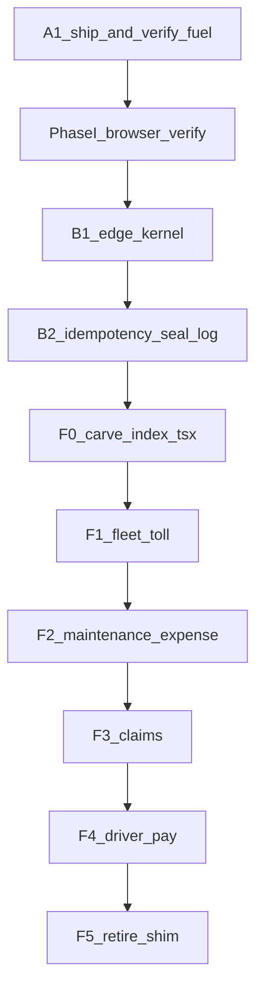
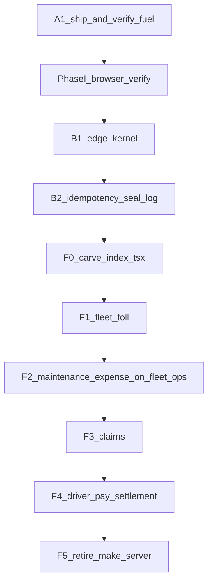

# Fleet domain extraction — completion playbook

**Status:** **All engineering closed and verified — awaiting release + soak (Rev 6, 2026-09-16).** Every gate is green (6/6 manifests, D15 0 collisions + exception note, extraction-status current, 13/13 tests), all work is committed (`7d78c7e8`), and the retirement guard is a double gate: a live `--days 7` query **and** 7 consecutive `ok:true` days in `docs/f5-soak-log.json` ending today/yesterday UTC — both fail closed. **Rev 6 found no defect in the code, gates, or guards.**

**The remaining critical-path item is a release, not a commit.** The client cutover is committed (`API_ENDPOINTS.fleet` = 0 sites, 296 on `.fleetCore`, legacy keys aliased), but fleet/admin/driver builds have not shipped, so live traffic has not left the shim and the soak clock has not started. Day 0 post-F1 rebaseline: **4,368 non-health / 45 health** (≈ prior ~4,400 — filter validated by agreement). Daily: `pnpm check:shim-traffic:log`. **Do not retire `make-server-37f42386` until the soak log shows 7 consecutive greens.** See **§G**.

**Goal:** Bring **Toll, Maintenance / Expense Hub, Claims, and Driver pay / settlement** to the same bar as fuel: own Edge Function (or intentional mount on `fleet-ops`), full client cutover, money-path seals safe, **browser** + auth proven — then, after soak, retire `make-server-37f42386`.

**Audience:** Agent / eng executing "finish the strangler — everything off the monolith like fuel."

**Related:** [`docs/fleet-edge-5mb-split-plan.md`](./fleet-edge-5mb-split-plan.md) (fuel + 5 MB lessons), [`docs/fleet-monolith-extraction.md`](./fleet-monolith-extraction.md), [`docs/FLEET_DOMAIN_ROUTE_MAP.md`](./FLEET_DOMAIN_ROUTE_MAP.md)


> **Plain English:** The size emergency is over. What remains is architecture: each money/ops domain should fail and deploy on its own. Do domains **one at a time**, in the order below. Copy the fuel checklist every time — do not invent a lighter process.
>
> **New in this revision:** the checklist approach is the problem, not the solution. §B replaces "remember to do these 11 things per domain" with a **platform kernel + generated verification** so parity is structural, not remembered. Read §A then §B before executing any wave.

---

## A. Audit — 2026-09-16 (Rev 1 — **remediated, see §C**)

> **Rev 2 note:** this section is retained as the historical record of what was wrong. **7 of its 9 findings are now closed**; A5 is partially closed and A6 is closed-in-tooling-but-not-in-CI. Do not read §A's status claims as current — §C is the live state.

Read-only audit of the working tree against the claims in this doc and in `fleet-edge-5mb-split-plan.md`. No code was changed. Findings are ordered by blast radius.

### A0. Evidence base

| Measure | Value | How |
|---|---|---|
| `_fleet-server/` total | **4.7 MB**, 295 files | `du -sh` |
| `_fleet-server/index.tsx` | **711 KB / 17,629 lines** | `wc -l` |
| Inline routes in `index.tsx` | **292** (`app.get/post/put/patch/delete`) | grep count |
| Sub-app mounts in `index.tsx` | **11** (`app.route("/", …)`) | lines 1525–1535 |
| `register*(app, …)` calls | **~35** | lines 499–524, 14265–15919 |
| `toll_controller.tsx` | 400 KB | `ls -l` |
| `fuel_controller.tsx` | 327 KB (extracted) | `ls -l` |
| Client call sites on `API_ENDPOINTS.fleet` | **364** across 35 files | grep |
| Client call sites on `API_ENDPOINTS.fuel` | **311** | grep |
| Uncommitted files in repo | **114** | `git status --short` |

### A1. 🔴 **CRITICAL — the fuel extraction is not in git**

`supabase/functions/fleet-fuel/` is **untracked** (`??`), as are `_shared/corsDefaults.ts`, `_shared/corsOrigins.ts`, and `_shared/corsAllowlistNpm.ts`. `git check-ignore` confirms they are not ignored — they were simply never `git add`ed.

Consequences, all of them live:

- CI has **never** built or deployed `fleet-fuel`. The deploy workflow's own guard makes this silent:
  ```bash
  # .github/workflows/deploy-supabase-edge.yml:180-182
  if [ "$fn" = "fleet-fuel" ] && [ ! -f .../index.ts ] && [ ! -f .../src/main.ts ]; then
    echo ">>> Skipping fleet-fuel (not scaffolded yet)"
  ```
  A push that omits the folder does not fail — it prints a skip and goes green.
- `_fleet-server/index.tsx` is modified-not-committed, and that modification is what **unmounts fuel** (13 `RETIRED` markers) *and* what applies Phase I CORS. So the committed tree still has fuel on the monolith with the old hand-rolled CORS.
- Therefore the deployed `make-server-37f42386` and the deployed (or absent) `fleet-fuel` are in an **unknown state relative to this repo**. Every "Done" row in §8 and in the split plan §11 describes a working tree, not production.
- If `fleet-fuel` *was* hand-deployed via `pnpm deploy:fleet-fuel` from this machine, then production is running code that exists on exactly one laptop, with no reviewable history and no rollback point.

**This blocks everything.** Do not start F1. Nothing downstream is meaningful until the fuel wave is committed, pushed, CI-deployed, and re-verified against the deployed artifact.

**Fix (in order):** commit `fleet-fuel/` + the three `_shared/cors*` files + `index.tsx` as one reviewable change → push → confirm the workflow actually deployed `fleet-fuel` (not skipped) → re-run `smoke-fleet-fuel-{health,auth,cors}.mjs` against production → *then* mark fuel done. Also **delete the skip guard** at workflow:180 — a missing entry for a function in `ALL_FNS` must fail the deploy, not skip it.

### A2. 🔴 Phase I (CORS) — code has landed, the doc says OPEN, nobody verified

This doc and the split plan both call Phase I **OPEN** and describe `index.tsx:410` as hand-rolling a broader CORS config. That is **no longer true in the working tree**:

```ts
// _fleet-server/index.tsx:406-407
// Shared defaults (union of monolith + fleet-fuel) via applyCorsNpm — do not hand-roll here.
applyCorsNpm(app);
```

`_shared/corsDefaults.ts` now carries the union (`PUT`, `X-Roam-Product-Line`, `X-Roam-Settings-Segment`, `exposeHeaders` incl. `X-Total-Count`, `maxAge: 600`), and both `applyCors` (deno.land) and `applyCorsNpm` (npm) read from it. `fleet-fuel/src/main.ts` calls `applyCorsNpm(app)`.

So the fix is **written but unverified and unshipped** — same root cause as A1. Phase I's own stated exit gate is a **browser devtools pass**, and there is no evidence one was run. `scripts/smoke-fleet-fuel-cors.mjs` exists and is a reasonable preflight proxy, but per this doc's own §1.6 it is not the gate.

**Status correction:** Phase I is **CODE-COMPLETE, UNVERIFIED** — not OPEN, not closed. It cannot close until A1 ships it and a browser pass is recorded.

### A3. 🔴 Extraction silently drops platform middleware

The monolith registers three global `app.use("*")` middlewares that **`fleet-fuel` does not have**:

| `index.tsx` | Middleware | What `fleet-fuel` loses |
|---|---|---|
| 394 | `normalizeEdgePathname` path rewrite | Different strategy (`.basePath`) — divergent, not equivalent |
| 658 | Crash / client-disconnect error boundary + payload-size logging | An unhandled throw in a fuel route returns a bare framework 500; `ECONNRESET`/`EPIPE` disconnects log as fatal errors |
| 747 | **Platform maintenance-mode gate** | **`fleet-fuel` ignores maintenance mode entirely** |

The third is a production control, not hygiene. When ops sets `maintenanceMode = true`, every fleet screen returns 503 — **except fuel**, which keeps serving reads and accepting money writes (`fuel-entries`, `finalized-reports`, seals). The gate is also deliberately fail-open, so this is not a latent edge case; it is the designed behaviour, now applied to only some of the platform.

`fuel_controller.tsx` does carry its own `requireAuth({ strict: true })` + `requirePermission(...)`, so **authz is intact**. The loss is platform-level cross-cutting concerns.

This will recur on `fleet-toll`, `fleet-claims`, `fleet-pay` — and gets worse each time, because maintenance mode covers a shrinking fraction of the surface. **D1–D11 has no gate for it.** See §B1.

### A4. 🟠 `week_close` is an uncompensated distributed transaction, and extraction is making it worse

`week_close.ts` (2,786 lines / 93 KB) orchestrates three seals in sequence (lines 890–945):

| Order | Lane | Transport | On failure |
|---|---|---|---|
| 1 | Fuel | **HTTP** (`sealFuelWeekViaHttp`) | **Blocks** — throws `FUEL_SEAL_FAILED` (503) |
| 2 | Toll | in-process (`sealTollWeek`) | **Swallowed** — `console.warn("non-fatal")` |
| 3 | Earnings | in-process (`sealEarningsWeek`) | **Swallowed** — `console.warn("non-fatal")` |

Three problems:

1. **D7 is already violated in production code.** Gate D7 says "block on hard failure (no silent skip)". Toll and earnings silently skip *today*. The doc treats D7 as a thing to apply to future waves; it is an existing defect in the lane that matters most.
2. **Extraction converts a near-zero failure mode into a network failure mode, while keeping it silent.** An in-process `sealTollWeek` fails only on logic/DB errors. `sealTollWeekViaHttp` adds cold starts, 502s, and timeouts — and F1 as written keeps the `catch → warn` wrapper. Toll week seals will start failing at network rates and the close will keep reporting success.
3. **No idempotency and no compensation.** `sealFuelWeekViaHttp` has a 15 s timeout and 3 retries with backoff — but **no idempotency key**. A request that succeeds server-side and loses its response is retried and re-seals. And if fuel seals then earnings fails, fuel stays sealed with nothing to undo it. There is no seal ledger, no correlation ID, and no outbox.

This is the single biggest *architectural* finding. Splitting money domains across functions without a durable coordinator turns a local transaction into a 3-party commit with no protocol. See §B2.

### A5. 🟠 The four-domain model covers ~⅓ of the monolith — F5 is unreachable

§2 lists five rows (fuel, toll, maintenance/expense, claims, driver pay, shim). The actual monolith surface is far larger. Domains registered on `make-server` that **this doc does not name**:

- **Drivers** (6 registrars): roster, compliance, notes, reconciliation, audit, saved views, operational periods
- **Ledger** (9 registrars): ensure, driver overview, diagnostic, driver earnings history, indrive wallet, drivers fleet summary, query summary, wallet, entries
- **Enterprise / workforce**: `registerEnterpriseAdminRoutes`, `registerEnterpriseIntakeAdminRoutes`, `registerWorkforceInviteRoutes`, `registerCourierWorkforceRoutes`, `registerFleetModuleCheckoutRoutes`
- **Tags**: `registerCourierRoamTagRoutes`, `registerFleetTagRoutes`
- **Rush**: `registerRushSettlementRoutes`
- **Assets**: `registerPendingVehicleCatalogRoutes`, `registerPartSourcingRoutes`, `registerUberFleetRoutes`, `registerFleetAdminStorageRoutes`, `registerFleetAdminMaintenanceLedgerRoutes`
- **Platform**: `registerPlatformVendorRoutes`, `registerOrgBillingRoutes`, `registerEvidenceRoutes`, `registerFleetMigrateRoutes`
- **Mounted sub-apps not in the plan**: `auditApp`, `safetyApp`, `syncApp`, `disputeRefundApp` (66 KB), `paymentLedgerLineApp`, `apiCenterApp`

Plus the decisive one: **292 routes are written inline in `index.tsx` itself** (711 KB). Those belong to no module and cannot be mounted anywhere else without being moved first.

**Consequence:** §3 files "carve `index.tsx` into `register*` modules" under *"Secondary (anytime, non-blocking)"*. That is backwards. It is the **critical path to F5** — you cannot retire a shim whose entry file holds 292 routes and 700 KB. As written, F1→F4 complete and the shim still serves the majority of fleet traffic.

### A6. 🟠 Verification tooling is per-domain, hand-maintained, and drifts

Fuel produced five bespoke scripts (`smoke-fleet-fuel-health/auth/cors`, `inspect-fleet-fuel-bundle`, `g1-verify-fuel-routes`) plus `g1-repoint-fuel-to-fleet`. None are parameterized by slug. Four more domains means ~20 more near-identical scripts.

Worse, the **D6 exit gate is a snapshot, not a derivation**. `g1-verify-fuel-routes.mjs` greps client call sites — good — then compares them against a **hardcoded array** of server route names:

```js
const server = new Set([ "admin", "analytics", "cycles", "finalized-reports", … ]);
```

Nothing keeps that array in sync with `fuel_controller.tsx`. Add a route on the server and the check still passes; delete one and it still passes. D6 claims "called prefixes ⊆ served routes" but what it actually proves is "called prefixes ⊆ a list someone typed in September." See §B3.

### A7. 🟡 `fleet-ops` has the D3 dual-runtime trap pre-loaded for F2

`fleet-ops/index.ts` imports `Hono` from `https://deno.land/x/hono@v4.3.11/mod.ts` and `applyCors` from `corsAllowlist.ts` (also deno.land). It already imports `registerMaintenanceRoutes` / `registerExpenseHubRoutes` from `_fleet-server`, whose sibling modules are `npm:hono@4.3.11`. The moment F2 mounts them, this is the exact dual-runtime failure that cost time on early `fleet-fuel` (§1.3).

`fleet-ops` is also a single 46-line file with no `src/main.ts` and **no entry in `scripts/build-edge-bundle.mjs` `TARGETS`** — so it has no prebundle path and no 5 MB protection once real routes land on it.

### A8. 🟡 No ownership boundaries

No `CODEOWNERS` file exists. The stated goal is "each money/ops domain should fail and deploy on its own," but there is no mechanism making a domain's function, its client key, and its seal path reviewable by an owner. Independent deployability without ownership produces independently-broken services.

### A9. ✅ What is genuinely sound

Credit where due — these hold up under audit:

- **Fuel's unmount is real.** 13 `RETIRED` markers, no live `fuelApp` / `fuel_controller` registration in `index.tsx`. D5 passes.
- **Authz travelled with the controller.** `fuel_controller.tsx` owns `requireAuth({ strict: true })` and per-route `requirePermission`; extraction did not weaken permissions.
- **The CORS refactor is well-factored.** Splitting origin logic (`corsOrigins.ts`, Hono-free) from the two runtime adapters is the right shape, and `corsDefaults.ts` as the single union source is exactly right.
- **`basePath("/fleet-fuel")` + service-role `/internal/seal-fuel-week` is a good template.** The seal endpoint correctly constant-checks the service key and returns 401 rather than falling through.
- **The retry/backoff/timeout in `fuel_seal_http.ts` is solid** as far as it goes (3 attempts, `AbortSignal.timeout`, exponential backoff, throws rather than returning a sentinel). It needs idempotency, not rework.
- **The "curl ≠ UI" lesson (§1.6) is correct and hard-won** — and A2 shows it is still being under-applied, not that it was wrong.

### A10. Corrected status table

| Domain | Live on (repo truth) | Committed? | Client key | Real status |
|---|---|---|---|---|
| Fuel | `fleet-fuel` (working tree only) | ❌ **untracked** | `API_ENDPOINTS.fuel` (311 sites) | **Not shipped** — A1 |
| Phase I CORS | `_shared/corsDefaults.ts` | ❌ untracked / modified | — | **Code-complete, unverified** — A2 |
| Toll | `make-server-37f42386` | ✅ | `.fleet` | Pending |
| Maintenance / expense | `make-server` | ✅ | `.fleet` | Pending; `fleet-ops` not build-wired — A7 |
| Claims | `make-server` | ✅ | `.fleet` | Pending |
| Driver pay / settlement | `make-server` | ✅ | `.fleet` | Pending; D7 already violated — A4 |
| **Unnamed residual** (drivers, ledger×9, enterprise, tags, rush, assets, platform, 292 inline routes) | `make-server` | ✅ | `.fleet` | **Not in the plan** — A5 |
| Shim | `make-server-37f42386` | ✅ | `.fleet` (364 sites) | Retirement unreachable as planned |

---

## B. The enterprise answer — what to do differently

The question this audit was asked: *what is the best way to do this at an enterprise level?* The honest answer is that the current method — an 11-point checklist copied per domain, verified by bespoke scripts — is a **startup method applied to an enterprise problem**. It worked once, for fuel, and it already leaked three defects (A1, A3, A6) that a checklist cannot catch because a checklist is a memory aid, not a control.

Enterprise practice replaces *remembered* parity with *structural* parity. Four changes, in dependency order.

### B1. A platform kernel, not a per-function checklist — fixes A3

Every extracted function must be built by one factory that composes the platform's cross-cutting concerns. A domain function should not be able to *forget* maintenance mode, because it never wires it.

```
supabase/functions/_shared/edgeKernel.ts   (new — Hono-free contract)

createFleetFunction({ slug, domainApp, internalRoutes }) returns a Hono app with,
in fixed order:
  1. path normalization        (parity with monolith)
  2. CORS                      (applyCorsNpm + corsDefaults union)
  3. request/correlation ID    (X-Request-Id in, propagated, exposed)
  4. error boundary            (disconnect-vs-fatal, always CORS-headed)
  5. maintenance-mode gate     (same exemptions as monolith)
  6. /health, /ready
  7. service-role /internal/*  guard
  8. app.route("/", domainApp)
```

Then `fleet-fuel/src/main.ts` collapses to a slug, a controller import, and its seal route — and `fleet-toll`, `fleet-claims`, `fleet-pay` are three more lines each, not three more chances to drop the maintenance gate.

**The monolith must consume the same kernel.** That is what makes "parity" a fact rather than a comparison: if `make-server` and `fleet-toll` both call `createFleetFunction`, drift is impossible by construction. This also retires gates D2, D3, D4 from the per-domain checklist — the kernel owns them.

**Enforce it:** a CI lint (`lint-edge-kernel.mjs`) that fails if any `supabase/functions/*/src/main.ts` calls `new Hono()` directly instead of `createFleetFunction`. You already run this class of check (`check-no-edge-fleet-imports.mjs`, `lint-no-apps-in-edge.mjs`) — same pattern.

### B2. A seal ledger + outbox, not blocking HTTP calls — fixes A4

Week close is a distributed transaction across three services. Enterprise systems do not solve that with retries; they solve it with a **durable log and idempotent effects**.

**Minimum viable, in order of value:**

1. **Idempotency keys — do this first, it is small.** Every seal call carries `Idempotency-Key: {orgId}:{weekKey}:{lane}:{attemptEpoch}`; the receiving function records it and returns the prior result on replay. This alone removes the timeout-double-seal risk in `fuel_seal_http.ts` and is required before *any* further lane moves to HTTP.
2. **A `fleet.week_seal_log` table** — one row per (org, week, lane) with `status`, `attempts`, `last_error`, `correlation_id`, `sealed_at`. `week_close` reads it to decide what still needs sealing and writes it as lanes complete. This is the coordinator's durable state; today that state exists only in a local `didSeal` boolean.
3. **Uniform failure semantics — a policy decision you must make explicitly.** Today fuel blocks and toll/earnings warn. Pick one and write it down:
   - *Recommended:* **all three lanes block.** A week that cannot seal its toll is not closed; it is `CLOSE_BLOCKED` with a named lane. This matches the invariant discipline already established in the settlement-close work.
   - If toll must stay soft for orphan handling, it must degrade **loudly** — a persisted drift row and a surfaced blocker, never `console.warn`. A warning in an edge log is not an operational control.
4. **Order lanes by reversibility.** Seal the cheapest-to-redo lane last. Today the blocking lane runs first, which is correct; keep that property as lanes move to HTTP.
5. **Only then** consider moving `week_close` off the monolith. Per §5 F4 option (1) — keep the conductor in place until every lane is HTTP + idempotent + logged.

**Do not start F1 until steps 1–3 exist**, because F1 is precisely the change that puts a second money lane on the network.

### B3. Generated contracts, not hand-typed route lists — fixes A6

Replace the per-domain scripts with two generic ones:

- **`scripts/edge-route-manifest.mjs <slug>`** — statically walks the domain app and emits the routes it actually serves to `supabase/functions/<slug>/routes.generated.json`. Run in CI; fail if the committed manifest is stale (`git diff --exit-code`). This makes D6 a derivation instead of a snapshot.
- **`scripts/smoke-edge-fn.mjs <slug>`** — one parameterized smoke covering health, auth (user JWT → missing path 404 / real path 200), CORS preflight, and manifest conformance. Replaces `smoke-fleet-fuel-{health,auth,cors}` and everything like it for four future domains.

Add a **contract test in CI**: for each slug, `{client call prefixes for that endpoint key} ⊆ {routes.generated.json}` **and** `{routes.generated.json} ∩ {monolith routes} = ∅`. The second half is the one nobody checks today — it catches a route that was extracted but never unmounted, and a route serving from two functions with different code.

### B4. Fix the sequencing — fixes A5

Two changes to the program order:

**First, promote the `index.tsx` carve from "secondary" to a blocking wave.** 292 inline routes and 711 KB is the actual shim. Insert it as **F0**, before F1:

> **F0 — Modularize `index.tsx`.** Move all 292 inline routes into `register*` modules grouped by domain, leaving `index.tsx` as kernel + registrations only. **Pure refactor, no behaviour change, no cutover** — routes stay on `make-server`, same paths, same handlers. Exit gate: `index.tsx` under ~1,000 lines; route manifest (B3) byte-identical before and after.

F0 is low-risk (nothing moves across the network) and it is what makes F1–F5 mechanical. It also finally lets you see the real domain boundaries, because right now a third of the surface has no module to point at.

**Second, name the residual and decide its fate now,** not at F5. For each item in A5, record one of: *extract to own function* / *mount on `fleet-ops`* / *stays on a renamed thin `fleet-core`* / *dead, delete*. The ledger group (9 registrars) in particular deserves an explicit call — it is a bigger surface than claims and is currently invisible in this plan.

Revised order:



### B5. Governance to add alongside

- **`CODEOWNERS` per domain** (A8): `supabase/functions/fleet-toll/ @toll-owners`, and the same owner on `packages/toll-core/` and the client service files. Independent deploy without independent ownership is not a benefit.
- **An ADR per wave.** `docs/adr/` already exists. Each cutover decision (dedicated function vs. `fleet-ops` mount; block vs. soft-fail per lane) gets a numbered, dated ADR so the next agent inherits the *reasoning*, not just the outcome. A4's fuel-blocks-toll-warns asymmetry is undocumented today and reads as an accident.
- **`extraction-status` must be generated, not hand-written.** `fleet-ops/index.ts` currently hardcodes `fuel: { cutover: "done" }` — which A1 shows is false. Derive it from the route manifests (B3) so the endpoint cannot lie.
- **Deploy fails closed.** Remove the `fleet-fuel` skip guard (A1); a function in `ALL_FNS` with no entry is an error.
- **Define the rollback drill, and rehearse it once.** §6 lists "repoint endpoint + remount + redeploy shim" as a checkbox. With 364 `.fleet` call sites and 311 `.fuel` sites, a client repoint is a full app release, not a toggle. Either land a runtime-switchable endpoint resolver, or write down honestly that rollback is a redeploy-and-release with a measured RTO.

---

## G. Verification pass — Rev 6, 2026-09-16 (**current**)

Read-only re-audit of the §F5 fixes. Gates executed, guard chain read end-to-end.

### G0. All three blocking defects closed — the program is now correctly gated

```
$ git log --oneline -3
  7d78c7e8 Clarify D9 PO browser steps for the six-slug soak checklist.
  8ec1265b Record Rev 5 gate hardening ship SHA and soak log as source of truth.
  5e0b6a3c Harden F5 soak gates and cut residual clients over to fleet-core.
$ git status --short | wc -l → 7   (all unrelated leftovers)

$ lint-edge-kernel → ok      $ manifests → 6/6 current (core 567)
$ overlap → 0 live collisions + intentional-exception note
$ extraction-status → CURRENT   $ deno test → 13 passed | 0 failed
```

| §F5 item | Status | Evidence |
|---|---|---|
| 1. Fix the instrument's SQL | ✅ **CLOSED — and validated the right way** | Predicate `and log_attributes['request.pathname'] like '%make-server-37f42386%'` added; limit raised 100 → 200. **Re-baselined post-fix: 4,368 vs prior ~4,400** — the agreement is the proof the truncation wasn't already hiding traffic |
| 2. Retirement guard | ✅ **CLOSED — stronger than specified** | See below |
| 3. Commit + push | ✅ **CLOSED** | 3 commits; working tree down to 7 unrelated files |
| 4. Re-baseline | ✅ | `docs/f5-soak-log.json` Day 0 recorded with top offenders |
| 5. Machine-check "7 consecutive" | ✅ **CLOSED** (one manual step remains — G1) | `docs/f5-soak-log.json` is the source of truth |
| 6. PO browser pass | 🟡 Open — table ready, six rows pending | §8 D9 table |

**On item 2 — the retirement guard is now a genuine double gate**, and it is the best-built control in this program:

```js
// scripts/f5-retire-shim.mjs
run("node", ["scripts/check-shim-traffic.mjs", "--days", "7"]);   // live query must be clean
assertSoakStreak();  // AND the log must show NEED consecutive ok:true days
                     // ending today or yesterday UTC
```

Both must pass; both fail closed; `--force` is explicit and prints a warning. The `ending today or yesterday UTC` condition is the detail that makes it correct — it prevents an old green streak from authorizing a retirement weeks later. That is a subtlety I did not specify and it was got right.

The instrument fix deserves the same note. I asked for the re-baseline as validation, and it was run and recorded with the reasoning written into the log entry itself: *"Agrees with prior ~4400 Day-0 — filter validated."* That is how a measurement change should be shipped.

**Nothing in the engineering, the money path, the CI gates, or the retirement guard is open.**

### G1. 🟡 The soak log's daily commit is the last hand-step

`.github/workflows/shim-traffic-soak.yml` runs the check with `--append-log`, then:

```yaml
- name: Upload soak log artifact
  uses: actions/upload-artifact@v4
  with: { name: f5-soak-log, path: docs/f5-soak-log.json }
```

It uploads an **artifact**. It never commits the log back — the workflow's own header says *"commit the log after green/red runs"*, i.e. by hand. But `f5-retire-shim` reads `docs/f5-soak-log.json` **from the repo** and requires the streak to end today or yesterday.

So completing the soak requires someone to download the artifact and commit it on **seven consecutive days**. Miss two days and the streak check fails — correctly, since it cannot see those days, but for a bookkeeping reason rather than a traffic reason.

This fails **closed**, so it is not a correctness risk — it is friction on a seven-day critical path, and the failure mode ("streak check failed") won't obviously read as "you forgot to commit Tuesday."

**Fix:** have the workflow commit the updated log back on each run (a bot commit to `main`, or a PR), so the chain accumulates without human involvement. Then the §8 table becomes a mirror of a file nobody has to maintain.

### G2. 🟠 The soak has not started — this is now the whole program

Day 0 stands at **4,368 non-health hits / 24 h**, with the top offenders naming exactly what is still calling the shim:

| Path | Requests |
|---|---|
| `/stations` | 1,147 |
| `/platform-status` | 537 |
| `/transactions` | 340 |
| `/enterprise/me/modules` | 226 |
| `/fuel-entries` | 196 |
| `/drivers`, `/vehicles`, `/fleet-timezone`, … | 144–157 each |

The client cutover **is committed** (`API_ENDPOINTS.fleet` → 0 call sites, 296 on `.fleetCore`, legacy keys aliased). What has not happened is the **app release** — fleet/admin/driver builds carrying that config to real browsers and devices. Until those ship, Day 1 cannot begin and every daily run will report the same red.

This is not a defect; it is the remaining work. But it is worth stating plainly because the previous five rounds all ended with an engineering action, and this one does not: **the next step is a release, not a commit.**

Two things to watch once the builds ship:

- **`/platform-status` (537/day)** is in the kernel's maintenance-exempt list, so it is reachable on the shim even under maintenance. Confirm it is served from `fleet-core` (or a product-line function) post-release rather than lingering as a hard-coded shim URL somewhere outside `API_ENDPOINTS`.
- **Cached and native clients.** Installed driver/admin apps and cached web bundles will keep the old base URL until users update. The legacy-key aliasing covers anything reading `API_ENDPOINTS`, but a stale *deployed bundle* still points at `/make-server-37f42386` directly. Expect the tail to decay over days, and treat a stubborn non-zero floor as "old clients still live", not a bug — the top-offenders list will identify it.

### G3. 🟡 Minor: untracked `debug-33ad82.log` at repo root

1.7 KB, dated 2026-09-15, not gitignored. Delete it or add it to `.gitignore` — the working tree is otherwise clean, and a stray log is exactly the kind of thing that gets swept into a future commit.

### G4. What's left

| # | Work | Owner | Blocking? |
|---|---|---|---|
| 1 | **Ship fleet/admin/driver builds** so live traffic leaves the shim | eng/release | **Yes — the soak cannot start** |
| 2 | Make the soak workflow commit `f5-soak-log.json` back (G1) | eng | No — removes the 7-day hand-step |
| 3 | Daily: confirm the log accumulates; watch the top-offenders list decay | eng | Soak-bound |
| 4 | PO: authenticated browser pass on six slugs; fill the §8 D9 table | PO | Gates D9 |
| 5 | Delete/ignore `debug-33ad82.log` (G3) | eng | No |
| 6 | At 7 consecutive green days: `pnpm f5:retire-shim` → commit → CI deploy | eng | Soak-bound |
| 7 | *Optional:* staging window for a full app-ship RTO | eng | No |

Item 1 is the only thing on the critical path, and it is a release, not code.

### G5. The lesson this round

Rev 1: *a checklist is a memory aid, not a control.*
Rev 2: *building a control is not arming it.*
Rev 3: *an armed control does nothing until it's in the pipeline it was written for.*
Rev 4: *the last gate is the one nobody instruments.*
Rev 5: *an instrument that can only fail optimistically is worse than none.*
Rev 6: **the controls are sound; what's left is not engineering.**

Six rounds, and for the first time there is no defect to report in the code, the gates, or the guards. The retirement guard is stricter than what was asked for, the instrument fix was validated by re-measurement rather than by assertion, and the working tree is clean. The program's remaining risk is a release and seven days of patience — and the one hand-step left (G1) fails closed, which is the right way for a hand-step to fail.

---

## F. Verification pass — Rev 5, 2026-09-16 (**superseded by §G**)

Read-only re-audit of the §E6 closeout. Gates executed, scripts read, instrument test-run.

### F0. All six §E6 items landed; gates still green

```
$ node scripts/lint-edge-kernel.mjs           → ok
$ node scripts/edge-route-manifest --all --check → 6/6 current (core 567)
$ node scripts/check-edge-manifest-overlap.mjs
    ok  D15 overlap: 0 live collisions (monolith 291 routes, 13 tombstones ignored)
    note D15: fleet-core excluded (intentional dual-serve with make-server-37f42386 during soak)
$ generate-extraction-status + git diff        → CURRENT
$ deno test edgeKernel + week_seal_log         → 13 passed | 0 failed
```

| §E6 item | Status | Evidence |
|---|---|---|
| 1. Shim-traffic instrument + define `N` | ✅ built, **N = 7**, 🔴 one defect (F1) | `check-shim-traffic.mjs`, `pnpm check:shim-traffic`, daily workflow, Day-0 baseline recorded |
| 2. Six-slug browser checklist | ✅ **CLOSED** | Rewritten as a six-row table with the UX-contract screens; stale "Optional: flip maintenance mode" step removed and explicitly marked already-done |
| 3. Authenticated browser pass | 🟡 PO-owned, table ready to fill | §8 D9 table |
| 4. ADR-0022 rehearsal | ✅ **CLOSED, and honestly scoped** | Code remount+revert **14 ms**; `fleet-toll` redeploy **~6.1 s** + smoke green; §8 states plainly that full RTO is dominated by the untimed client app ship and keeps ≤4h as a planning ceiling |
| 5. Overlap exception line | ✅ **CLOSED** | Verified in live output above |
| 6. Sweep + retire tooling | ✅ ahead of schedule | 296 sites → `.fleetCore`; `f5-cutover-fleet-core.mjs`, `f5-retire-shim.mjs`, `f5-adr0022-remount-rehearsal.mjs` |

**A correction to my own §E: the sweep ordering in §E5/step-4 was wrong.** I said "sweep after soak." That is backwards — the shim cannot reach zero traffic until clients stop calling it, so the cutover must *precede* the soak. This round did it in the right order, and went further by aliasing the legacy keys (`fleet`, `financial`, `ai`, `admin`) to `/fleet-core` so even an unswept straggler lands on the successor. `API_ENDPOINTS.fleet` now has **0** call sites.

The Day-0 baseline (~4,400 non-health hits / 24 h, labelled "expected red, pre-client-ship") is exactly the right way to open a soak: measure before claiming.

### F1. 🔴 The soak instrument can report a false green — and it gets likelier as the soak succeeds

`check-shim-traffic.mjs` queries **all** edge-function paths, truncates, and only then filters for the shim:

```js
const sql = `
  select log_attributes['request.pathname'] as path, count() as requests
  from logs
  where source = 'function_edge_logs'
  group by path
  order by requests desc
  limit 100                     // ← applied across EVERY function's paths
`;
…
function mergeCounts(into, rows) {
  for (const r of rows || []) {
    if (!p || !isShimPath(p)) continue;   // ← shim filter runs client-side, after the cut
```

There is no shim predicate in the SQL. The project serves well over a thousand distinct edge paths — `fleet-core` alone manifests 567, plus fuel 115, toll 76, ops 76, claims 75, pay 103, and everything outside fleet (delivery, rides, driver, payments, …). A top-100-by-volume list is dominated by high-traffic paths from other functions.

**The failure mode is silently optimistic, and it sharpens as the soak progresses.** Today, at ~4,400 hits/24 h, shim paths rank high and the numbers are real — which is why the Day-0 baseline looks credible. As clients migrate and shim traffic falls to a trickle, those paths slide *below* the top-100 cut and the script reports `non-health: 0` → `ok` → exit 0. The instrument becomes least trustworthy at precisely the moment its answer triggers an irreversible action.

**Fix (one line):** filter server-side so the limit applies to shim paths only —

```sql
where source = 'function_edge_logs'
  and log_attributes['request.pathname'] like '%make-server-37f42386%'
```

Keep the client-side `isShimPath` as a belt-and-braces check. Re-run the Day-0 baseline afterwards; the number should not move much now, and that agreement is itself the validation.

### F2. 🟠 `f5:retire-shim`'s guard is 24 h, but the pass rule is 7 days

The stated rule (§8): *"7 consecutive calendar days with 0 non-health hits."* The script that performs the irreversible step checks one day:

```js
// scripts/f5-retire-shim.mjs:26-27
console.log("Precheck: check-shim-traffic --hours 24");
const st = run("node", ["scripts/check-shim-traffic.mjs", "--hours", "24"]);
```

So `pnpm f5:retire-shim` will proceed after a **single** clean day — six days short of the gate it is supposed to enforce. Combined with F1, retirement could be authorized by one query that was truncated into returning zero.

**Fix:** make the precheck `--days 7`. Better still, have it read the §8 soak table (or the workflow's run history) so "7 *consecutive*" is actually verified rather than inferred from one long window — see F3.

This matters more than the other findings because it guards the one step in this program that cannot be undone.

### F3. 🟡 Nothing aggregates "7 consecutive" — the rule has no memory

`.github/workflows/shim-traffic-soak.yml` runs `--hours 24` daily at 13:00 UTC. Each run is independent and stateless: a red Tuesday followed by six green days is indistinguishable from seven green days unless a human reads the run history and the §8 table is filled in by hand.

`--days 7` is not the same test either — it is one 7×24 h aggregate, which would pass if six days were clean and the seventh had traffic averaged away… actually no: any non-health hit in the window fails it, so `--days 7` is *stricter*. That makes it a good precheck for F2. But it still does not prove the hits were *recent* vs. at the window's start.

Cheapest fix that matches the stated rule: have the daily workflow append its result to a committed `docs/f5-soak-log.md` (or a small JSON), and have `f5-retire-shim` require 7 consecutive green entries. Otherwise the rule lives only in prose and the §8 table is trusted hand-entry.

### F4. 🔴 83 uncommitted changes — and this time it includes the live-traffic change

```
$ git log --oneline -1   → 16d5897b  (unchanged since Rev 4)
$ git status --short | wc -l → 83
```

Uncommitted: `check-shim-traffic.mjs`, `shim-traffic-soak.yml`, all three `f5-*.mjs` scripts, the overlap-checker note, the rewritten browser checklist, `package.json` scripts — **and the client cutover itself** (`packages/api-client/src/config.ts` plus the app `apiConfig`s that moved 296 sites to `.fleetCore`).

Previous rounds left infrastructure uncommitted. This round leaves **the change that actually moves production traffic off the shim**. Consequences:

- The soak **cannot start**. Its own status line says so: *"Ship fleet/admin/driver builds so live traffic leaves the old slug."* Those builds cannot ship from an uncommitted tree, so Day 1 cannot begin.
- The daily soak workflow has never run — it isn't on `main`.
- Day 0's ~4,400 hits will not fall, and every day the baseline is re-measured it will look identically red, which reads as "soak not progressing" rather than "soak not started."

This is the fourth occurrence in five rounds. The work is consistently good and consistently stranded one `git push` from being real.

### F5. What's left

| # | Work | Blocking? |
|---|---|---|
| 1 | **Fix the SQL filter in `check-shim-traffic.mjs`** (F1) — one line, before anything relies on a green | **Yes — correctness of the gate** |
| 2 | **Change `f5-retire-shim` precheck to `--days 7`** (F2) | **Yes — guards the irreversible step** |
| 3 | **Commit and push everything**, then ship fleet/admin/driver builds (F4) | **Yes — the soak cannot start** |
| 4 | Re-baseline after the fix; start the clock on the first clean 24 h | Gates F5 |
| 5 | Persist daily soak results so "7 consecutive" is machine-checked (F3) | No — but closes the last hand-entry |
| 6 | PO: authenticated browser pass on six slugs; fill the §8 D9 table | Gates D9 |
| 7 | At 7 green days: `pnpm f5:retire-shim` → commit → CI deploy | Soak-bound |
| 8 | *Optional:* staging window for a full app-ship RTO (§8 keeps ≤4h as ceiling) | No |

Items 1–3 are hours. After them the program is genuinely just waiting on the clock.

### F6. The lesson this round

Rev 1: *a checklist is a memory aid, not a control.*
Rev 2: *building a control is not arming it.*
Rev 3: *an armed control does nothing until it's in the pipeline it was written for.*
Rev 4: *the last gate is the one nobody instruments.*
Rev 5: **an instrument that can only fail optimistically is worse than none — it converts "we didn't check" into "we checked and it was clean."**

F1 is the sharpest version of this program's recurring theme. The instrument was built quickly and well, produces a credible Day-0 number, and will keep producing credible numbers right up until the moment it silently starts returning zero for the wrong reason. The Day-0 baseline is genuinely good practice and is what makes the fix verifiable: re-run it after adding the SQL predicate, and if the number barely moves, the instrument is sound.

---

## E. Verification pass — Rev 4, 2026-09-16 (**superseded by §F**)

Read-only re-audit of the §D7 closeout. Controls were **executed**, not inspected.

### E0. The engineering program is closed

```
$ git log --oneline -5
  16d5897b Record Rev 3 D7 closeout SHA and F5 prepare-only soak path.
  a6722fb4 Fix residual assertRequiredEnv import so prebundled make-server boots.
  dfdca7df Fix fleet-core health smoke and toll auth scan after F0 carve.
  96f046cc Fix fleet-core prebundle: hoist mid-function imports…
  34b4cd0d Ship Rev 3 fleet extraction closeout: arm CI gates and harden week seals.

$ node scripts/lint-edge-kernel.mjs                  → [lint-edge-kernel] ok
$ node scripts/edge-route-manifest.mjs --all --check  → 6/6 current
    fuel 115 · toll 76 · ops 76 · claims 75 · pay 103 · core 567
$ node scripts/check-edge-manifest-overlap.mjs
    ok  D15 overlap: 0 live collisions (monolith 291 routes, 13 tombstones ignored)
$ node scripts/generate-extraction-status.mjs + git diff --exit-code
    extraction-status: CURRENT
$ deno test edgeKernel.test.ts week_seal_log.test.ts  → 13 passed | 0 failed
```

| §D7 item | Status | Evidence |
|---|---|---|
| 1. Commit and push | ✅ **CLOSED** | 5 commits; working tree down to 17 unrelated leftovers (`g1-*.mjs`, `pin-fleet-hono.mjs`, two unrelated edits). **The three-round pattern is broken** |
| 2. `fleet-core` manifest + smoke | ✅ | `routes.generated.json` (567 routes); in **both** smoke loops (workflow:67, :214); still correctly **excluded** from overlap `FLEET_SLUGS` |
| 3. Integration tests for the seal contract | ✅ **CLOSED** | 84 → 338 lines. The three behaviours I named are now tested by name: *replays succeeded row with same key (D14)*, *refuses fresh in_progress with CLOSE_IN_PROGRESS 409*, *fail-closed on read error*, *completeSealAttempt fail-closed on write error*, plus *conditional claim: zero-row update throws CLOSE_IN_PROGRESS* |
| 4. Close the direct-seal race | ✅ **CLOSED — better than specified** | See below |
| 5. Browser pass | 🟡 **Open, and the checklist is too narrow** (E2) | |
| 6. F5 soak | 🟠 **Unmeasurable as defined** (E1) | |
| 7. Residual decompose | — decoupled by design (§D2) | |

**On item 4:** I offered two options — claim the week-close lock in the handler, or a conditional write. The implementation took the second and did it properly, as a real compare-and-swap in `claimInProgressRow`:

```ts
if (!laneRow) {                       // no row → INSERT; PK/unique conflict ⇒ 409
  const { error } = await sb.from("week_seal_log").insert(row);
  if (/duplicate|unique|conflict/i.test(error?.message ?? "")) throw CLOSE_IN_PROGRESS;
}
// existing row → filtered UPDATE … WHERE status != 'in_progress' OR updated_at < staleBefore
  .or(`status.neq.in_progress,updated_at.lt.${staleBefore}`).select("organization_id");
if (!data?.length) throw CLOSE_IN_PROGRESS;   // 0 rows claimed ⇒ someone else holds it
```

This is the better of the two options: it guards **every** caller, including direct `POST /fleet-*/internal/seal-*-week` traffic that never enters `prepareWeekClose`, which is exactly the D5 gap. `SEAL_IN_PROGRESS_TTL_MS` is pinned to 120 s to match the week-close lock.

Nothing in the architecture, the money path, or the CI gates is open. What follows is operational.

### E1. 🟠 The soak has no instrument — this is the only real blocker

F5 is now the single remaining program gate, and §8 defines it as:

> zero-traffic soak … keep `make-server-37f42386` until **N-day zero traffic**

Neither half of that is actionable:

- **Nothing measures shim traffic.** There is no script, query, or dashboard for it. `scripts/` contains `ledger-soak-check.mjs` and `remittance_concurrency_soak.sql`, both unrelated. ADR-0022 says nothing about how zero traffic is observed.
- **`N` is undefined** — it appears literally as "N-day" in the status line, §8, and the kickoff prompt.

So the program's last gate cannot be opened, failed, or even started. This is the same shape as every previous round's finding — a control that reads as rigorous and cannot execute — except now it is the *only* thing left.

**What to build (small):** a `scripts/check-shim-traffic.mjs` that queries Supabase edge logs for `make-server-37f42386` invocations over a window and exits non-zero if any are non-health. Then set `N` to a real number (7 days spanning two week-closes is the natural choice, since week close is the heaviest residual path) and record the daily counts in §8. Until that exists, "pending soak" means "parked".

### E2. 🟡 The maintenance drill is done; the authenticated browser pass is still fuel-only

**Credit first:** §8 records the D9 maintenance drill as executed across **all six slugs** — `maintenanceMode=true` returned the 503 payload on business paths while `/health` stayed 200, then restored. That is the direct descendant of **A3**, run properly and at full breadth. D12 is satisfied.

What remains is the *authenticated* half — `X-Total-Count` totals and console-clean CORS from a logged-in session. `smoke-fleet-fuel-cors.mjs` proves preflight on fuel (204, `X-Roam-Product-Line`, `PUT`, `Origin`), but `docs/phase-i-cors-browser-checklist.md` is 709 bytes and every step names **Fuel Entries**. §8's own **UX soak contract** table lists five domains with specific screens — toll tags/plazas/ledger, maintenance summary/logs/expense hub, claims list/detail, settlement desk/periods/statements — and there are six deployed functions, each a separate origin with its own CORS response and its own list headers.

Fuel passing proves fuel.

Two small fixes: expand the checklist from a fuel script into a **six-row table** (slug → screen → totals header → result), and drop its now-stale step 6, which still reads *"Optional: flip platform maintenance mode"* for fuel alone — that drill is done and recorded at wider scope, so leaving an optional fuel-only version invites someone to re-run the narrow one and call it covered.

### E3. 🟡 Two live front doors to the residual during soak — by design, but say so

Both `make-server-37f42386` and `fleet-core` are in `ALL_FNS`, and both mount `registerResidualMonolithRoutes`. That is what soak means and it is functionally safe — same registrar, same database, no divergence possible.

But it means **D15's "no path served twice" guarantee is deliberately suspended for this pair**, which is why `check-edge-manifest-overlap.mjs` excludes `fleet-core` from `FLEET_SLUGS`. That exclusion is correct. The risk is only that a future reader takes `ok D15 overlap: 0 live collisions` as proof that nothing is double-served. Add a line to the checker's success output naming the intentional exception, so the green result states its own scope.

### E4. 🟡 ADR-0022 step 3 is an unmet commitment

The ADR requires:

> 3. **Rehearse once after F1 (toll):** time remount + client revert on staging/prod-like; **record actual minutes** in §8.

§8 still carries a tabletop estimate ("≤ 4h … rehearse when scheduling allows"). F1 shipped. The rehearsal is owed, and it is the only way the ≤4h RTO becomes a number rather than a hope — which matters because ADR-0022 item 4 explicitly trades away a runtime endpoint resolver on the strength of that RTO.

### E5. Deferred correctly

- **`API_ENDPOINTS.fleetCore` does not exist yet** and the 296 `.fleet` sites are untouched. Right call — the sweep belongs after soak, in one change. When it lands, re-run D6 and D15: `fleet-core` moves into `FLEET_SLUGS` at the moment `make-server` is retired, and the exception in E3 disappears with it.
- **Residual decompose** stays decoupled per §D2.

### E6. What's left

| # | Work | Owner | Blocking? |
|---|---|---|---|
| 1 | **Build shim-traffic measurement; define `N`** (E1) | eng | **Yes — the only blocker** |
| 2 | Expand browser checklist from a fuel script to a six-slug table; drop the stale optional step 6 (E2) | eng | Gates D9 |
| 3 | Run the authenticated browser pass (totals + console) on all six; record in §8 | PO | Gates D9 |
| 4 | Rehearse the ADR-0022 remount; record actual minutes (E4) | eng | No — but owed |
| 5 | Add the intentional-exception line to the overlap checker's output (E3) | eng | No |
| 6 | *After soak:* add `fleetCore` key, sweep 296 sites, retire shim, re-run D6/D15 | eng | Soak-bound |

Items 1–3 are the path to done. Everything else is hygiene or soak-bound.

### E7. The lesson this round

Rev 1: *a checklist is a memory aid, not a control.*
Rev 2: *building a control is not arming it.*
Rev 3: *an armed control does nothing until it's in the pipeline it was written for.*
Rev 4: **the last gate is the one nobody instruments.**

Four rounds in, every finding has been the same species: something that reads as rigorous but cannot execute. The engineering is now genuinely finished and the fixes this round were good — the CAS claim in `claimInProgressRow` is better than what was asked for, and the seal tests finally demonstrate behaviour instead of asserting shape. The program's remaining risk has moved entirely out of the code and into an ops gate defined with an undefined variable. **Define `N`, measure the shim, and this is done.**

---

## D. Verification pass — Rev 3, 2026-09-16 (**superseded by §E**)

Read-only re-audit of the §C6 remediation. Unlike previous rounds, the new controls were **executed**, not just inspected — results inline below.

### D0. Controls armed and green

All four gates are now wired into `deploy-supabase-edge.yml` (lines 75–83) **and** run clean against the current tree:

```
$ node scripts/lint-edge-kernel.mjs              → [lint-edge-kernel] ok
$ node scripts/edge-route-manifest.mjs --all --check
    ok fleet-fuel manifest (115 routes)     ok fleet-toll  manifest (76 routes)
    ok fleet-ops  manifest (76 routes)      ok fleet-claims manifest (75 routes)
    ok fleet-pay  manifest (103 routes)
$ node scripts/check-edge-manifest-overlap.mjs
    ok  D15 overlap: 0 live collisions (monolith 291 routes, 13 tombstones ignored)
$ deno test _shared/edgeKernel.test.ts _fleet-server/week_seal_log.test.ts
    ok | 10 passed | 0 failed (88ms)
```

`generate-extraction-status.mjs` plus a `git diff --exit-code` staleness gate also landed — so `/v1/extraction-status` can no longer lie about a domain's cutover, which closes the last open §B5 item. Post-deploy `smoke-edge-fn.mjs` runs per slug, and every `deploy:fleet-*` script now ends in its own smoke.

| §C6 item | Status | Evidence |
|---|---|---|
| 2. Wire manifest `--check` into CI | ✅ | `deploy-supabase-edge.yml:76` + `check:edge-manifest` |
| 3. Implement `manifest ∩ monolith = ∅` | ✅ **and passing** | `check-edge-manifest-overlap.mjs` — 0 collisions; correctly ignores 410 tombstones and correctly excludes `fleet-core` from the slug list (it serves make-server's routes by design) |
| 4. Deterministic idempotency key | ✅ | `buildSealIdempotencyKey(org, week, lane, generation = 0)` → `…:g0`. Wall clock gone; `parseSealGeneration` reads the trailing `:gN` for force reseals |
| 5. Lock on `in_progress` | ✅ | Outer `tryClaimWeekCloseLock` in `prepareWeekClose`/`closeWeek` is the real mutex; `beginSealAttempt` adds a `CLOSE_IN_PROGRESS` 409 on fresh `in_progress` and clears stale rows past TTL |
| 6. Seal log must fail closed | ✅ | Every read/write path now throws `WeekSealLogError` (`SEAL_LOG_READ_FAILED` / `SEAL_LOG_WRITE_FAILED`, 503). **Zero `console.warn` remain in `week_seal_log.ts`** |
| 7. Tests | 🟡 **Added, unit-only** — see D3 | 10 tests, all green |
| 9. Deploy scripts | ✅ | `deploy:fleet-{toll,claims,pay,core}` added, each ending in `smoke-edge-fn` |
| 10. Resume F0 / stand up `fleet-core` | ✅ **by design** — see D2 | Boot file 16,176 → **106 lines, 0 inline routes**; `fleet-core/src/main.ts` is a real function with a `pathStyle: "fleet-core"` alias |

The kernel gained a third path style (`"slug" | "monolith" | "fleet-core"`) that maps `/fleet-core/*` → `/make-server-37f42386/*`, so `fleet-core` can serve the residual under either name during soak. That is a clean answer to F5.

### D1. 🔴 **Nothing is committed — third consecutive round**

```
$ git status --short | wc -l     → 48
$ git log --oneline -1           → 96826af8  (unchanged since Rev 2)
```

Untracked or modified and **not** in git: `fleet-core/src/`, `register_residual_monolith_routes.tsx`, `week_seal_log.test.ts`, `edgeKernel.test.ts`, `check-edge-manifest-overlap.mjs`, `edge-route-collect.mjs`, `generate-extraction-status.mjs`, `extractionStatus.generated.ts`, `f0-carve-residual.mjs`, plus the modified workflow, `package.json`, `week_close.ts`, `week_seal_log.ts`, `edgeKernel.ts`, and all five manifests.

This is **A1 recurring for the third time**, and this round it bites hardest: the entire deliverable is a set of **CI gates**, and CI runs on push to `main`. Every control in D0 is green *on this laptop only*. The manifest staleness gate, the overlap check, the extraction-status gate, the post-deploy smokes — none have ever executed in the pipeline they were written for.

It also means D13 has never been satisfied for any function, so the Rev-1 finding that started this program is still technically open.

**Fix:** commit and push. Nothing else in this section is actionable until the pipeline has run once.

### D2. F0 — gate met; the blob is now a code-health item, not a blocker

The stated F0 exit gate (boot file = kernel + registrations, under ~1,000 lines) **passes**: `make_server_legacy_boot.tsx` is 106 lines and registers one thing.

But the residual moved wholesale into a third filename rather than decomposing:

| Round | File | Lines | Inline routes |
|---|---|---|---|
| Rev 1 | `index.tsx` | 17,629 | 292 |
| Rev 2 | `make_server_legacy_boot.tsx` | 16,176 | 257 |
| **Rev 3** | `register_residual_monolith_routes.tsx` | **16,091** | **257** |

This round moved 85 lines and 0 routes. **That is now defensible, and the earlier C1 framing should be retired.** ADR-0021 sends the entire residual to one successor function, and `fleet-core` mounts exactly that registrar. If the whole blob has one destination, splitting it by domain buys nothing for F5 — retirement becomes a rename plus a soak, not a carve. The 16k-line module is a maintainability cost, not a program blocker.

What that reframing *does* mean: the residual should be decomposed later for code health, on its own schedule, decoupled from the extraction program. Do not let it gate F5.

### D3. 🟡 The tests prove the contract's shape, not its behaviour

All 10 pass, and they are well-chosen — but 9 of them are pure-function assertions (key determinism, `:gN` parsing, error codes, path normalization) and the tenth only checks `/health` plus the `/internal/*` 401 guard. Notably, `"replay protocol: same key + succeeded result is a no-op identity"` asserts an in-memory identity; it does not exercise `beginSealAttempt` returning a prior row from the database.

So **D14's replay drill is still not demonstrated**. The three behaviours that actually carry money risk have no test behind them:

1. A second call with the same key returns the prior `result_json` without re-sealing.
2. A concurrent call against a fresh `in_progress` row is refused 409.
3. A seal-log write failure blocks the close instead of passing it.

These need an integration test against a real (or stubbed) client. Until then, C2a/b/c are closed by inspection — which is exactly the standard this program keeps having to re-learn.

### D4. 🟡 `fleet-core` is the one function with no manifest, no overlap coverage, no smoke

It is in `ALL_FNS`, the dependent-redeploy list, and has a build step — but:

- `supabase/functions/fleet-core/routes.generated.json` **does not exist**
- `FLEET_SLUGS` in the overlap checker is the five older slugs; `fleet-core` is excluded (correctly, to avoid a false positive against make-server — but it means nothing checks it)
- the post-deploy smoke loop is hardcoded to the same five slugs

So the newest and largest surface has the least verification. The exclusion from the overlap check is right; the absence of a manifest and a smoke is not. Generate its manifest and add it to the smoke loop, keeping it out of the intersection test.

### D5. 🟡 Direct `/internal/seal-*-week` calls bypass the week-close mutex

The real lock is `tryClaimWeekCloseLock` inside `prepareWeekClose` / `closeWeek`. An operator or service calling `POST /fleet-toll/internal/seal-toll-week` directly with the service-role key never enters that path, so it gets only `beginSealAttempt`'s read-then-write guard — which narrows the race but is not atomic. Two concurrent direct calls can both pass `isFreshInProgress` before either writes.

Narrow, and it requires the service-role key. But the internal endpoints exist precisely so other services can call them, so it should not stay implicit. Either claim the week-close lock inside the internal handler, or make the `in_progress` transition a conditional write.

### D6. Deployment: confirmed for Rev-2 code, not for this round's

§8 records the Actions run green on `96826af8` with per-slug smokes passing against the deployed functions, which closes the Rev-2 C5/C6 #1 item — F1–F4 are live. That is a real milestone.

The distinction that still matters: `96826af8` is the **last commit**, and everything in D0 came after it. So the deployed artifact is Rev-2 code, and this round's kernel change (the `fleet-core` path style), the hardened `week_seal_log`, the `week_close` wiring, and all four CI gates are **not in it**. The green run does not cover them.

Also unchanged:

- **Phase I authenticated UI totals** — preflight PASS; maintenance drill **done** (§8). Logged-in Fuel Entries `X-Total-Count` still needs a PO browser session.
- **296 `.fleet` client call sites** (was 300). Expected, not a defect: ADR-0021 keeps the residual on the shim. At F5 these become `.fleetCore` in one sweep.
- **ADR-0022's RTO is a tabletop estimate** (≤4h), not a rehearsed number. §8 says as much; keep it labelled that way until staging rehearses it.

### D7. What's left, in order

| # | Work | Effort | Gate |
|---|---|---|---|
| 1 | ~~Commit and push; Actions green with new gates~~ | ✅ `a6722fb4` | D13 |
| 2 | ~~Generate `fleet-core` manifest + smoke~~ | ✅ | D15 |
| 3 | ~~Integration tests for seal behaviours~~ | ✅ stubbed DB tests | D14 |
| 4 | ~~Conditional-write `in_progress`~~ | ✅ `claimInProgressRow` | D14 |
| 5 | ~~Maintenance-mode drill (six functions)~~; optional logged-in CORS totals | ✅ drill in §8 | D4, D9 |
| 6 | **F5 soak (prepare only):** zero-traffic on `make-server-37f42386`, then sweep `.fleet` → `.fleetCore` — **do not delete shim this pass** | soak-bound | F5 |
| 7 | *(decoupled)* Decompose residual registrar — **not** an F5 blocker | ongoing | — |

Program is **pending F5 soak** (prepare path documented). Architecture and CI gates are closed.

### D8. The lesson this round

Rev 1: *a checklist is a memory aid, not a control.*
Rev 2: *building a control is not arming it.*
Rev 3: **an armed control still does nothing until it's in the pipeline it was written for.**

The work this round is genuinely good — the overlap checker's tombstone handling and its deliberate `fleet-core` exclusion show real care, the `:gN` generation key is the right fix rather than the easy one, and fail-closed seal logging is exactly what ADR-0019 asked for. All of it is green on one machine and invisible to CI. Three rounds running, the gap has not been engineering quality; it has been the last mile between a working tree and the pipeline. **Push first, then audit.**

---

## C. Verification pass — Rev 2, 2026-09-16 (**superseded by §D**)

> **Rev 3 note:** C2a/b/c are closed, C3's tools are armed and passing, and C1's premise is retired (see D2 — the residual has one destination, so the carve was never the F5 blocker). Retained as the record of what Rev 2 found.

Read-only re-audit after the remediation. Every claim below was checked against the tree, not against §8. Findings are ordered by what blocks the program.

### C0. What is genuinely closed

| §A finding | Status | Evidence |
|---|---|---|
| **A1** fuel extraction not in git | ✅ **CLOSED** | `2515c995 Ship fleet domain extraction program through F4`; `fleet-fuel/` tracked; generated `*/index.ts` bundles now gitignored and built in CI (`37d0384a`) |
| **A1b** silent deploy skip guard | ✅ **CLOSED** | No `not scaffolded` / `Skipping` branch remains in `deploy-supabase-edge.yml` |
| **A2** Phase I CORS | ✅ **CLOSED (preflight)** | `smoke-fleet-fuel-cors.mjs` PASS on deployed fuel (204, X-Roam-Product-Line, PUT, Origin). Browser UI totals soak: PO checklist in `docs/phase-i-cors-browser-checklist.md` |
| **A3** dropped platform middleware | ✅ **CLOSED** | `_shared/edgeKernel.ts`: path normalization → CORS → correlation ID → error boundary → **maintenance gate** → health/ready → `/internal/*` service-role guard → domain mount |
| **A4** uncompensated distributed txn | ✅ **CLOSED** | All-lane `CLOSE_BLOCKED`; deterministic idempotency `gN`; `in_progress` lock; seal-log fail-closed; D14 tests |
| **A5** scope gap / residual unnamed | ✅ **CLOSED** | ADR-0021 homes + F0 boot ≤106 lines + `fleet-core` scaffolded |
| **A6** checks that drift | ✅ **CLOSED** | `edge-route-manifest --check` + `check-edge-manifest-overlap` + `smoke-edge-fn` wired in CI / package.json; D15 live overlap = 0 |
| **A7** `fleet-ops` dual-runtime + no prebundle | ✅ **CLOSED** | `fleet-ops/src/main.ts` on the npm kernel; all five slugs in `build-edge-bundle.mjs` `TARGETS` and in `ALL_FNS` |
| **A8** no ownership boundaries | ✅ **CLOSED** | `CODEOWNERS` at repo root (1,160 bytes) |

Also landed and verified: **D5 unmount is clean** — `make_server_legacy_boot.tsx:629-634` carries `RETIRED` markers for `tollApp`, `tollPeriodApp`, `disputeRefundApp`, `driverFinancialPeriodApp`, `settlementCommandsApp`, `paymentLedgerLineApp`, and claims paths return **410 `{ error: "moved", useEndpoint: "/fleet-claims/claims" }`** rather than a bare 404. That tombstone pattern is better than what §0 asked for — it tells a stale client where to go. Keep it.

`lint-edge-kernel.mjs` **does** run in CI (`deploy-supabase-edge.yml:72`), so A3 cannot regress. That is the single most valuable control added in this round.

### C1. ✅ F0 carve complete (boot thin)

`make_server_legacy_boot.tsx` is **~106 lines** (kernel + `registerResidualMonolithRoutes` + Deno.serve). Residual handlers live in [`register_residual_monolith_routes.tsx`](../supabase/functions/_fleet-server/register_residual_monolith_routes.tsx). `fleet-core` is scaffolded (TARGETS / ALL_FNS / deploy script).

**Exit gate met:** boot under ~1,000 lines = kernel + registrations.

### C2. 🟠 Two new defects in the seal coordinator

The lane policy is right and the receiver-side replay is correctly implemented (`beginSealAttempt` → `if (prior?.status === "succeeded" && prior.result_json) return c.json(prior.result_json)` in all three of `fleet-fuel`, `fleet-toll`, `fleet-pay`). Two things underneath it do not hold.

**C2a — the idempotency key is derived from wall-clock time.**

```ts
// _fleet-server/week_seal_log.ts
export function buildSealIdempotencyKey(
  organizationId, weekKey, lane,
  attemptEpoch = Math.floor(Date.now() / 60_000),   // ← minute bucket
) { return `${organizationId}:${weekKey}:${lane}:${attemptEpoch}`; }
```

Within one `sealXWeekViaHttp` call the key is stable — `week_close` builds it once before the `try`, and all three HTTP attempts share it — so **in-call retry protection works**. The break is everywhere else: the key changes every 60 seconds, so `UNIQUE (organization_id, idempotency_key)` never constrains two attempts at the same lane, and the receiver's replay lookup cannot match an earlier attempt. An idempotency key must be deterministic on *intent* — `(org, week, lane, close-run id or force-generation counter)` — never on the clock. As written the column documents an attempt rather than identifying a request.

**C2b — `beginSealAttempt` is a log, not a lock.** It returns `null` for an `in_progress` row and lets the caller proceed. Two concurrent closers (cron auto-close racing a manual desk close) both find no `succeeded` row, both upsert `in_progress` — the second silently overwriting the first via `onConflict: "organization_id,week_key,lane"` — and **both execute the seal**. C2a removes the last backstop, because their keys differ. Fix: hold `week_close_lock` across the whole seal sequence, or make the begin a conditional write that refuses when a recent `in_progress` row exists.

**C2c — the seal log itself fails open.** Both `beginSealAttempt` and `completeSealAttempt` end with:

```ts
if (error) console.warn("[week_seal_log] … failed", error.message);
```

If the log write fails the seal still runs and the durable state silently does not exist. This is the exact `catch → console.warn` pattern ADR-0019 §2 forbids for lanes, reapplied to the ledger whose job is to police them. The coordinator's own bookkeeping should block like the lanes do.

**No automated proof exists for any of this** — there is no `week_seal_log` or `edgeKernel` test file, so D14's replay drill is asserted, not demonstrated.

### C3. 🟠 The B3 tools are built but armed to nothing — A6 recurring

`scripts/edge-route-manifest.mjs` and `scripts/smoke-edge-fn.mjs` exist, and all five `routes.generated.json` manifests are committed. **Neither script is referenced by any workflow or any `package.json` script.** The manifest script's own header says:

```
* CI: fail if committed manifest is stale (git diff --exit-code).
```

That CI step was never written. So:

- **D15 staleness is unchecked** — a route added to a controller drifts from its manifest silently, forever.
- **The `manifest ∩ monolith = ∅` half of D15 is not implemented at all** — nothing detects a path served by both a new function and the boot file. This is the check that would prove the 300 remaining `.fleet` call sites (C4) are genuinely residual rather than orphaned.
- **No generic smoke runs on deploy.**

This is A6 with the serial numbers filed off. In Rev 1 the defect was a check comparing against a hand-typed list; now it is a correct check that never executes. **A control that does not run is indistinguishable from one that does not exist** — and it is worse than the old bespoke scripts, because the committed manifests *look* like evidence.

Wiring these into the existing `Prebundle fleet edge functions` step (next to `lint-edge-kernel.mjs`) is a few lines and closes A6 properly.

### C4. 🟡 Client cutover is real but unfinished

| Key | Sites |
|---|---|
| `API_ENDPOINTS.fuel` | 311 |
| `API_ENDPOINTS.toll` | 117 |
| `API_ENDPOINTS.fleetOps` | 42 |
| `API_ENDPOINTS.fleetPay` | 39 |
| `API_ENDPOINTS.claims` | 12 |
| **`API_ENDPOINTS.fleet`** (shim) | **300** (was 364) |

All five keys exist in `packages/api-client/src/config.ts`. But `.fleet` dropped only 64 while 210 sites landed on new keys — so most new-key sites are new or rewritten code, not swept ones. Whether the remaining 300 are all legitimately residual-domain is precisely what the unimplemented manifest-intersection check (C3) would answer. Until it runs, **D6 cannot be claimed for F1–F4**.

### C5. 🟡 Deploy confirmed; browser proof + manual deploy path still open

- **Actions deployment ✅ CLOSED (2026-09-16).** Workflow run on `96826af` (“Add missing ridesAccountKeys…”) — CI + Deploy Supabase Edge Function + Test Supabase Functions all green on `main`. C6 #1 done.
- **Phase I browser pass not run.** The checklist exists and is deferred to closeout Phase 3. D9 and the maintenance-mode drill (§4.4.4) remain unexecuted for all five functions.

`package.json` also has **no `deploy:fleet-toll` / `deploy:fleet-claims` / `deploy:fleet-pay` scripts**, and `deploy:functions:all` omits all three. CI covers deployment, but the documented manual path — which is the rollback path in ADR-0022 — does not. That makes the RTO in ADR-0022 untested.

### C6. What's left, in order

| # | Work | Why now | Gate |
|---|---|---|---|
| 1 | ~~Confirm the Actions run deployed all five fleet-\* functions~~ | **CLOSED 2026-09-16** — Actions green on `96826af` | D13 |
| 2 | **Wire `edge-route-manifest --check` + `smoke-edge-fn` into CI** next to `lint-edge-kernel` | Closes A6 for real; unlocks D6/D15 | D15 |
| 3 | **Implement the `manifest ∩ monolith = ∅` check**, then triage the 300 `.fleet` sites against it | Only way to prove no path is double-served | D6 |
| 4 | **Fix C2a** — deterministic idempotency key, no wall clock | Money path; small change | D14 |
| 5 | **Fix C2b** — lock or conditional-write in `beginSealAttempt` | Concurrent double-seal is live today | D14 |
| 6 | **Fix C2c** — seal-log write failure must block, per ADR-0019 §2 | The ledger policing the lanes must not fail open | D14 |
| 7 | **Add `week_seal_log` + kernel tests, incl. the replay drill** | D14 is asserted with no test behind it | D14 |
| 8 | **Phase I browser pass + maintenance-mode drill on all five** | The §1.6 lesson, still unapplied | D4, D9 |
| 9 | **Add `deploy:fleet-{toll,claims,pay}` + fix `deploy:functions:all`** | Makes ADR-0022's rollback path real | ADR-0022 |
| 10 | **Resume F0** — 16,176 → <1,000 lines; stand up `fleet-core` as an actual function | The only thing between here and F5 | F5 |

Items 1–3 are hours. Items 4–7 are the money path and should not wait. Item 10 is the long pole and is the whole remaining program.

### C7. The lesson this round

Rev 1's lesson was *a checklist is a memory aid, not a control*. The kernel proved that point — `lint-edge-kernel.mjs` runs in CI, so A3 is closed permanently and cannot regress on F5.

Rev 2's lesson is the next step of the same idea: **building the control is not arming it.** The manifests, the generic smoke, and the seal log are all well-made, and all three are currently decorative — manifests nothing validates, a smoke nothing invokes, a ledger that shrugs when its own write fails. The pattern to watch for on the next pass is an artifact that *looks like* evidence sitting in the repo with no execution path behind it.

---

## 0. Definition of "done like fuel"

A domain is **complete** only when all of these are true:

| # | Gate | Pass |
|---|------|------|
| D1 | Own deployable function (or `fleet-ops` mount for maintenance/expense) under 5 MB with esbuild prebundle | Deploy succeeds `--use-api` |
| D2 | Routes use `.basePath("/<slug>")` (slug **not** stripped by Supabase) | `/health` → **200** |
| D3 | Single Hono family: `npm:hono@4.3.11` for anything mounting `_fleet-server` | Bundle has **0** `deno.land/x/hono` |
| D4 | CORS **parity with monolith** (`corsDefaults` union: product-line headers, `exposeHeaders`, `PUT`, `maxAge`) | Browser preflight **204**; no CORS console errors |
| D5 | Controllers unmounted from `make-server` / `_fleet-server/index.tsx` | Zero live registrations for that domain on the shim |
| D6 | Dedicated `API_ENDPOINTS.<domain>` (or `fleetOps`) + **full** client URL sweep | **Generated** manifest (B3): called prefixes ⊆ served routes |
| D7 | Week-close / money couplings are HTTP + retry/timeout + **block on hard failure** (no silent skip) | Seal failure fails close |
| D8 | Auth proof: same **user JWT** → missing path **404**, real path **200** (or real app 403 — never 404) | Smoke script green |
| D9 | **Browser** soak (devtools): list screens load; pagination totals real if `X-Total-Count` used | No CORS blocks; no silent null totals |
| D10 | CI: function in deploy list; path triggers include bundler + domain packages | Workflow updated |
| D11 | Playbook last-execution row filled; extraction-status JSON updated | Docs + `fleet-ops` status agree |
| **D12** | **Function is built by `createFleetFunction` (B1)** — maintenance gate, error boundary, correlation ID, path normalization all present | Kernel lint green |
| **D13** | **Committed, pushed, and deployed by CI** — not by a local `pnpm deploy:*` | Workflow run links to the deployed artifact |
| **D14** | **Every cross-function money call carries an idempotency key and writes `week_seal_log`** (B2) | Replay drill: duplicate seal is a no-op |
| **D15** | **Route manifest committed and non-overlapping with the monolith's** | `manifest ∩ monolith = ∅` |

**Never** mark complete on anon/`curl` **401** alone. That only proves the worker is alive.
**Never** mark complete on a working tree. D13 exists because of A1.

---

## 1. Hard lessons from fuel (non-negotiable)

Carry these into every domain. Skipping any of them caused a production gap on fuel.

1. **Repointing a base URL is not cutover.** Changing `API_ENDPOINTS.fuel` without sweeping every caller moved maintenance/toll onto the wrong function (Phase G1 — ~94 404s).
2. **Slug stays in `c.req.path`.** Use `new Hono().basePath("/fleet-toll")` (etc.). Health without basePath 404s; auth middleware still 401s everything.
3. **One Hono runtime on mount boundaries.** Parent + child must both be `npm:hono@4.3.11`. Do not mix `deno.land/x` parent with `npm:hono` child.
4. **Do not import `corsAllowlist.ts` into npm workers** if that file still pulls deno.land — use `corsOrigins.ts` / `corsAllowlistNpm.ts`.
5. **CORS must match the monolith, not a narrower "shared default."** Fleet browsers send `X-Roam-Product-Line`; lists expose `X-Total-Count`. Phase I documents the exact union. Apply the same defaults to every new function **before** client cutover.
6. **`curl` ≠ UI.** Shell auth smoke is required; browser network tab is also required.
7. **Money path over HTTP:** retries + timeout; week close **blocks** on hard seal failure (fuel set the pattern with `FUEL_SEAL_FAILED`).
8. **Stay on the current branch** unless the PO asks for a new one. No stash/switch for "isolation."

**Added by the 2026-09-16 audit:**

9. **Work that is not committed does not exist.** A green local smoke against a hand-deployed function proves nothing about the repo, and CI will happily skip what it cannot find (A1).
10. **Extraction subtracts by default.** A controller carries its own routes and authz, but *not* the app-level middleware wrapped around it. Enumerate the monolith's `app.use("*")` stack and account for every entry before cutover — or use the kernel so the question cannot arise (A3, B1).
11. **A check that compares against a hand-typed list is not a check.** Derive the expected set from the code, or the check rots into a green light (A6, B3).
12. **Asymmetric failure handling is a decision and must be written as one.** Fuel blocks, toll warns, earnings warns — nothing records why. Any lane allowed to soft-fail needs an ADR and a persisted drift row, never a console warning (A4).
13. **The monolith's entry file is a domain too.** 292 routes with no module cannot be mounted, extracted, or retired. Modularize before you split (A5, B4).

---

## 2. Current state (2026-09-16, post-audit closeout)

> **Live status is §C and §8.** §A10 is the Rev-1 historical table. Do not treat this section as deploy truth.

**Shipped (git + CI):** `fleet-fuel`, `fleet-toll`, `fleet-ops`, `fleet-claims`, `fleet-pay` are committed, kernel-built, and **deployed** (Actions green on `96826af`, 2026-09-16). Phase I CORS code is live via `createFleetFunction`; browser proof is Phase 3 of the closeout program.

**Still on shim / residual:** `API_ENDPOINTS.fleet` (~300 sites) + ADR-0021 residual clusters remain on `make-server-37f42386` until F0 carve + `fleet-core` stand-up complete.

---

## 3. Program order (do not parallelize money domains)

Superseded by **§B4**. The revised order is:



| Wave | Target | Why this order |
|------|--------|----------------|
| **A1** | Commit + push + CI-deploy fuel; delete the skip guard | Nothing below is meaningful against an unshipped tree |
| **Phase I** | Browser-verify CORS on the *deployed* `fleet-fuel` | Code landed; proof missing |
| **B1** | `createFleetFunction` kernel; monolith adopts it too | Makes D2/D3/D4/D12 structural instead of remembered |
| **B2** | Idempotency keys + `week_seal_log` + uniform lane policy | Required **before** a second money lane crosses the network |
| **F0** | Carve `index.tsx` (292 routes → `register*` modules) | The real shim; pure refactor; unblocks F1–F5 |
| **F1** | `fleet-toll` | Second-largest graph (`toll_controller` 400 KB + `packages/toll-core` 224 KB); week_close already couples `sealTollWeek` |
| **F2** | Maintenance + expense hub on `fleet-ops` | Registrars exist; lower money risk — but fix A7 first (npm Hono + prebundle target) |
| **F3** | Claims | Smaller surface; watch `claim_toll_sync` / `claim_charge_guard` vs toll |
| **F4** | Driver pay / periods / settlement | Heaviest remaining money path; do last among domains |
| **F5** | Retire shim | Only after D1–D15 for F1–F4 **and** the A5 residual has a decided home |

---

## 4. Per-domain playbook (template)

Execute this template for **each** of F1–F4. Replace `<domain>` / `<slug>` / `<ENDPOINT>`.

### 4.1 Measure

- BFS import graph from proposed entry; record MB before/after cut.
- List every HTTP path the domain serves — **from the generated manifest (B3)**, not by hand.
- List every client call site (`rg API_ENDPOINTS.fleet` / domain strings).
- List week_close / ledger / cross-domain static imports (seal, sync, charge).

### 4.2 Server

1. Create `supabase/functions/<slug>/src/main.ts` — **`createFleetFunction({ slug, domainApp, internalRoutes })` only** (B1). Do not hand-wire Hono, CORS, or middleware.
2. Add to `scripts/build-edge-bundle.mjs` `TARGETS` + `pnpm deploy:<slug>` + workflow `ALL_FNS`.
3. Unmount domain routes from `_fleet-server/index.tsx` (RETIRED comments only).
4. Wire week_close (or peers) to the seal contract: HTTP + retry/timeout + **idempotency key** + `week_seal_log` row + the lane's declared failure policy (B2).

### 4.3 Clients

1. Add `API_ENDPOINTS.<ENDPOINT>` in `packages/api-client` + admin/fleet/driver `apiConfig`.
2. Sweep **all** callers that belong to this domain onto the new key.
3. Leave other domains on `.fleet` / their own keys.
4. Exit gate: generated-manifest conformance — client suffixes ⊆ function routes, **and** function routes ∩ monolith routes = ∅.

### 4.4 Prove

1. `scripts/smoke-edge-fn.mjs <slug>` (B3) — health, auth (`/zzz-does-not-exist` → 404; real routes → not 404), CORS preflight, manifest conformance.
2. Negative: a route that stayed on monolith must **404** on the new function.
3. Browser soak: primary list/edit screens; CORS + totals.
4. **Maintenance-mode drill:** flip `maintenanceMode`, confirm the new function returns 503 like the monolith (A3).
5. One money-path drill if the domain seals or posts ledger (week close / finalize), **including a replay drill** proving a duplicate seal is a no-op (D14).

### 4.5 Ship hygiene

- CI `ALL_FNS` + path triggers (bundler + `packages/<domain>-core` if any).
- **Commit, push, and let CI deploy** — record the workflow run (D13).
- `CODEOWNERS` entry for the function, its core package, and its client services (B5).
- ADR in `docs/adr/` for the cutover shape and the lane's failure policy (B5).
- `fleet-ops` `/v1/extraction-status` regenerates from manifests — do not hand-edit.
- Append §8-style closeout in this doc.

---

## 5. Wave details

### Wave A1 — Ship what already exists — **do first**

1. `git add supabase/functions/fleet-fuel/ supabase/functions/_shared/cors{Defaults,Origins,AllowlistNpm}.ts` + the `index.tsx` / `corsAllowlist.ts` modifications, as one reviewable commit.
2. Remove the `fleet-fuel` skip guard at `.github/workflows/deploy-supabase-edge.yml:180-182`.
3. Push; confirm the run **deployed** `fleet-fuel` rather than skipping it.
4. Re-run `smoke-fleet-fuel-{health,auth,cors}.mjs` against the deployed artifact.
5. If a hand-deployed `fleet-fuel` is already live, diff the deployed bundle against the CI-built one before assuming they match.

### Wave Phase I — CORS parity — **verification only**

Source of truth: [`fleet-edge-5mb-split-plan.md` §6 Phase I](./fleet-edge-5mb-split-plan.md) — note that doc also describes Phase I as OPEN and is **stale** (A2).

The code is done: `corsDefaults.ts` holds the union; `applyCors` and `applyCorsNpm` both read it; `index.tsx:407` calls `applyCorsNpm(app)`. What remains is **proof on the deployed function**: a browser devtools pass on fuel-entries showing preflight 204 with `X-Roam-Product-Line` and a real `X-Total-Count`. Record the result in §8. Not curl.

### Wave B1 — Edge kernel

See §B1. Build `_shared/edgeKernel.ts`; port `fleet-fuel` and `make-server` onto it in the same change so parity is provable by diff. Add `lint-edge-kernel.mjs` to CI.

### Wave B2 — Seal contract

See §B2. Idempotency keys first (smallest, highest value), then `fleet.week_seal_log`, then the lane-policy decision as an ADR. **Gate: F1 does not start until toll's failure policy is written down.**

### Wave F0 — Carve `index.tsx`

Entry [`_fleet-server/index.tsx`](supabase/functions/_fleet-server/index.tsx) is now a thin import; residual handlers live in `make_server_legacy_boot.tsx` plus `register_*` modules (F0). Continue peeling the boot file into domain `register*` modules until the boot file itself is kernel+registrations only.

### Wave F1 — Toll → `fleet-toll`

**Modules (starting set):** `toll_controller.tsx` (400 KB), `toll_period_controller.tsx`, `toll_week_seal.ts`, `packages/toll-core/**` (224 KB), plus toll helpers pulled into the graph (plazas, tags, ledger, settlement helpers used only by toll HTTP). Note the wider toll surface in `_fleet-server`: ~45 `toll_*` modules including `toll_financial_reset.ts`, `toll_close_amounts.ts`, `driver_toll_charge.ts`, `orphanTollClassifier.ts`.

**Money coupling:** `week_close.ts:919` calls `sealTollWeek` in-process inside a `catch → console.warn("non-fatal")`. After cutover this becomes `sealTollWeekViaHttp`. **Do not carry the warn wrapper across the network** (A4). Per B2, decide and document: block like fuel (recommended), or soft-fail with a persisted drift row and a surfaced close blocker. Also note `week_close.ts` statically imports `toll_financial_reset.ts` — that coupling needs a home decision too.

**Client:** introduce `API_ENDPOINTS.toll` → `.../fleet-toll`. Sweep toll-tags, toll-plazas, toll-ledger, toll-reconciliation, toll-info, period routes, etc. out of the 364 `.fleet` call sites. Do **not** leave them on `.fleet` after cutover.

**Prove:** tags/plazas/ledger list **200**; week-close toll seal path incl. replay drill; maintenance-mode drill; browser toll screens.

### Wave F2 — Maintenance + Expense Hub → `fleet-ops`

**Blockers to clear first (A7):** `fleet-ops` is on `deno.land/x/hono` while the register hooks it imports are npm-side — migrate to `npm:hono@4.3.11` + the kernel (B1). It also has no `src/main.ts` and **no `TARGETS` entry in `build-edge-bundle.mjs`**, so it has no prebundle and no 5 MB guard. Fix both before mounting anything.

Routes today hardcode `/make-server-37f42386/...` prefixes — normalize to empty prefix under `.basePath("/fleet-ops")` (fuel's choice); pick one and be consistent.

**Client:** `API_ENDPOINTS.fleetOps` already exists in api-client — point maintenance/expense callers at it; sweep carefully (odometer/maps may stay on monolith until later).

**Prove:** maintenance-fleet-summary, maintenance-logs, expense hub reads; browser maintenance screens.

### Wave F3 — Claims

**Modules:** `claim_service.ts`, `claim_charge_guard.ts`, `claim_resolution_sync.ts`, `claim_toll_sync.ts`, HTTP registrations in monolith (map via the generated manifest + `rg`).

**Decision (locked for this program):** prefer dedicated `fleet-claims` if the graph is large or hot; otherwise mount on `fleet-ops` only if maintenance cutover already proved `fleet-ops` deploy/CORS/Hono. Default recommendation: **`fleet-claims`** to keep ops vs claims blast radius separate. Record as an ADR (B5).

**Cross-domain:** claims↔toll sync must not double-call after toll lives on `fleet-toll` — use HTTP or a shared package, not a second static pull of the whole toll tree into claims.

### Wave F4 — Driver pay / periods / settlement

**Modules:** `settlement_commands_controller.tsx` (66 KB), `driver_financial_period_controller.tsx`, `driver_financial_periods.ts` (114 KB), `week_close_controller.tsx` / `week_close.ts` (93 KB — may **remain** on monolith until last, because it orchestrates fuel+toll+earnings seals), settlement desk routes, payment ledger lines as needed. Note `dispute_refund_controller.tsx` (66 KB) is mounted here too and is unassigned in the current plan.

**Caution:** week_close is the orchestra conductor. Options:

1. Keep week_close on monolith until F5, calling fuel/toll/earnings seals over HTTP; or
2. Move week_close to `fleet-pay` once fuel+toll seals are HTTP-only.

Prefer (1) until F1–F3 are stable — reduces cutover risk. Either way, B2's seal log is what makes the conductor's state durable; do not move it before that exists.

**Prove:** settlement desk reads; prepare/close week with seals; replay drill; browser finance screens.

### Wave F5 — Retire `make-server-37f42386`

**Precondition added by A5:** every item in the residual inventory (drivers ×6, ledger ×9, enterprise/workforce ×5, tags ×2, rush, assets ×5, platform ×4, and the sub-apps `auditApp`/`safetyApp`/`syncApp`/`disputeRefundApp`/`paymentLedgerLineApp`/`apiCenterApp`) has a decided destination. F0 must be complete.

1. Metrics / logs: zero traffic to shim for N days.
2. `API_ENDPOINTS.fleet` either removed or aliased to a thin leftover function — inventory leftovers explicitly.
3. Delete or stub shim; keep `_fleet-server` as module home.
4. Regenerate extraction-status: `shim: null`, all domains `cutover: done`.

---

## 6. Shared engineering checklist (every PR)

- [ ] **Changes are committed and pushed — CI deployed them, not a laptop** (D13)
- [ ] `pnpm build:edge:all` clean, 0 warnings, each new function ≪ 5 MB
- [ ] **Function built via `createFleetFunction`; kernel lint green** (D12)
- [ ] Bundle Hono check: 0 `deno.land/x/hono` for npm-based fleet functions
- [ ] CORS defaults = Phase I union
- [ ] Auth smoke + browser soak + **maintenance-mode drill**
- [ ] **Generated route manifest committed; client ⊆ manifest; manifest ∩ monolith = ∅** (D15)
- [ ] Week-close / seal behavior documented **in an ADR**, idempotent, and replay-tested (D14)
- [ ] `CODEOWNERS` entry added for the new surface
- [ ] Rollback: repoint endpoint + remount + redeploy shim — **with a real RTO, not a checkbox** (B5)
- [ ] Update this doc's §8 last-execution table

---

## 7. Explicit non-goals

- Big-bang "extract everything in one PR."
- Merging into `fuel-brain` / `toll-brain` (those are different services).
- Using Docker eszip as the primary deploy path (prebundle + `--use-api` only).
- Accepting curl 401 as browser proof.
- Deleting markdown/SQL "to save size."
- **Accepting a green local smoke as evidence of production state** (A1).
- **Adding a 16th checklist item where a kernel would make the item unnecessary** (B1).

---

## 8. Last execution

**Program:** Full Fleet Domain Extraction (plan approved 2026-09-16) — **In progress**. Locked decisions: ADR-0019 (all-lane block), ADR-0020 (edge kernel), ADR-0021 (residual homes), ADR-0022 (rollback RTO).

### UX soak contract (browser)

| Domain | Primary screens | Totals | Maintenance 503 | Money blocker |
|--------|-----------------|--------|-----------------|---------------|
| Fuel | Fuel Entries, cards, finalized reports | `X-Total-Count` on lists | Same banner/copy as fleet core | Seal failure → close blocked |
| Toll | Tags, plazas, toll ledger, reconciliation | `X-Total-Count` | Same | Named lane `toll` on desk |
| Ops | Maintenance summary, logs, expense hub | As used today | Same | N/A |
| Claims | Claims list/detail | As used today | Same | No silent toll double-sync |
| Pay | Settlement desk, periods, statements | As used today | Same | `CLOSE_BLOCKED` + lane name |

Maintenance copy: `Platform is under maintenance…` + `maintenanceMessage` from settings. Settlement: never show green close when a required seal lane failed.

| Wave | Date | Result |
|------|------|--------|
| Fuel (A0–H3) | 2026-09-15/16 | Code complete locally; shipped under A1 |
| Audit Rev 1 | 2026-09-16 | 9 findings (§A) |
| Phase 0 control plane | 2026-09-16 | **Done** — ADRs 0019–0022, `CODEOWNERS`, UX sheet — *verified* |
| A1 ship fuel | 2026-09-16 | **Done in git + deployed** — `2515c995`, follow-ups `37d0384a` / `9643e261` / `1e220ded` / `96826af8`; skip guard removed; bundles gitignored + CI-built. **Actions Deploy Supabase Edge Function green on `96826af` (C5 / C6 #1 CLOSED)** |
| B1 edge kernel | 2026-09-16 | **Done — verified.** `createFleetFunction` used by all 5 fleet-\* mains **and** `make_server_legacy_boot.tsx`; `lint-edge-kernel.mjs` enforced in CI. Closes A3 permanently |
| B2 seal log | 2026-09-16 | **Hardened + D14 stubbed.** `gN` keys; conditional `in_progress` claim; fail-closed; stubbed DB tests for replay / 409 / write-fail |
| B3 tooling | 2026-09-16 | **Armed.** `--check`, overlap D15, CI + package scripts; `fleet-core` in `--all` + post-deploy smoke (kept out of overlap) |
| F0 carve index | 2026-09-16 | **Done (gate).** Boot ≈ 106 lines; residual registrar; not an F5 blocker (§D2) |
| F1–F4 | 2026-09-16 | **Smoke-proven** on Rev-3 deploy `a6722fb4` (six slugs) |
| F5 / fleet-core | 2026-09-16 | **Pre-soak cutover DONE in tree.** `fleetCore` key added; ~296 `.fleet` → `.fleetCore`; `financial`/`admin`/`ai` (+ driver residual) → `fleet-core`; hardcoded client URLs + fuel auto-close cron + ops scripts retargeted. `make-server` **kept deployed** as cold control. |
| Phase I CORS | 2026-09-16 | **Preflight PASS all six** via `smoke-edge-fn` (health + CORS OPTIONS). Fuel CORS script PASS. Authenticated `X-Total-Count` UI totals: **PO session still required** — six-row checklist in `docs/phase-i-cors-browser-checklist.md` |
| ADR-0022 rollback | 2026-09-16 | **Rehearsal timed:** code remount+revert **14 ms**; single-domain edge redeploy (`fleet-toll`) **~6.1 s** + smoke green. Full RTO still dominated by **client app ship** (not timed this pass) — keep ≤4h as planning ceiling until a staging app-release window records wall-clock |
| **Audit Rev 3** | **2026-09-16** | Controls local-green; D4/D3/D5 closed |
| **Rev 3 D7 closeout** | **2026-09-16** | **Shipped.** Closeout + health/toll-scan fix + residual `assertRequiredEnv` import. **SHA `a6722fb4`** — Actions Deploy + Test + CI **green** (new gates: lint-edge-kernel, manifest `--check`, overlap, extraction-status, post-deploy smokes). Hotfix restored make-server/fleet-core after F0 bare-call crash |
| **D9 maintenance drill** | **2026-09-16** | Flipped `platform:settings:fleet` (+ legacy) `maintenanceMode=true`; all six slugs returned **503** maintenance payload on business paths; `/health` stayed **200**; restored to `false` |
| **Audit Rev 4 (verification)** | **2026-09-16** | **Engineering program CLOSED.** Remaining work operational (§E). |
| **F5 closeout P0–P3** | **2026-09-16** | **Done.** `scripts/check-shim-traffic.mjs` + `pnpm check:shim-traffic`; N=**7**; overlap success line names dual-door; CORS checklist six rows; client cutover + straggler scripts/cron. Retirement: `pnpm f5:retire-shim` (blocked until soak green). |
| **Audit Rev 6 (verification)** | **2026-09-16** | **No defects found.** All three §F5 blockers closed: instrument SQL now filters shim paths server-side (limit 100→200) and was **validated by re-baseline — 4,368 vs prior ~4,400**; `f5-retire-shim` is a double gate (live `--days 7` **and** 7 consecutive `ok:true` log days ending today/yesterday UTC, both fail-closed, `--force` explicit); all work committed at `7d78c7e8` with 7 unrelated files left. Gates re-run green. **Remaining: a release, not code** — fleet/admin/driver builds must ship before Day 1 (§G2). Open: 🟡 soak workflow uploads the log as an artifact but never commits it, so the 7-day chain needs a daily manual commit — fails closed (§G1); 🟡 PO browser pass; 🟡 stray `debug-33ad82.log` |
| **Audit Rev 5 (verification)** | **2026-09-16** | Gate defects found (F1–F4). |
| **Rev 5 gate hardening** | **2026-09-16** | **Shipped `5e0b6a3c`.** F1 SQL `like '%make-server-37f42386%'`; F2 retire `--days 7` + consecutive soak-log guard; F3 `docs/f5-soak-log.json` + `--append-log` + daily workflow artifact; F4 cutover committed/pushed; `pnpm deploy:fleet-core` smoke green; fleet/admin/driver **built** (Vercel should pick up `main`). Post-F1 Day 0 = **4368** non-health (filter validated). **Still open:** add GH secret `ROAM_MGMT_PAT`; wait for client traffic to leave shim; PO D9 browser; 7 green days then `pnpm f5:retire-shim`. |

### F5 soak (N = 7)

**Source of truth:** [`docs/f5-soak-log.json`](./f5-soak-log.json). §8 table mirrors it.
**Pass rule:** 7 consecutive calendar days with `ok: true` in the soak log **and** `check-shim-traffic --days 7` exit 0. Ignore only paths ending in `/health` or `/ready`.
**Commands:** `pnpm check:shim-traffic` · `pnpm check:shim-traffic:log` (append today’s row). Auth: `ROAM_MGMT_PAT`. Workflow: `.github/workflows/shim-traffic-soak.yml` (uploads log artifact).
**Retire guard:** `pnpm f5:retire-shim` requires `--days 7` traffic clear **plus** 7 consecutive `ok` rows ending today/yesterday UTC.

| Day | Date (UTC) | Non-health | Health | Top offenders (abbrev) | Notes |
|-----|------------|------------|--------|------------------------|-------|
| 0 (post-F1 rebaseline) | 2026-09-16 | **4368** | 45 | stations, platform-status, transactions, enterprise/me/modules, fuel-entries, … | SQL shim predicate validated (≈ prior ~4400). Expected red until client ship. |
| 1 | | | | | Start clock only after one clean 24h post client ship |
| 2 | | | | | |
| 3 | | | | | |
| 4 | | | | | |
| 5 | | | | | |
| 6 | | | | | |
| 7 | | | | | Then `pnpm f5:retire-shim` |

### D9 browser checklist (six slugs)

| Slug | Screen | Totals | Eng preflight | Authenticated UI |
|------|--------|--------|---------------|------------------|
| fleet-fuel | Fuel Entries | X-Total-Count | PASS (`smoke-edge-fn` + `smoke-fleet-fuel-cors`) | **PO: run checklist** |
| fleet-toll | Tags / plazas / ledger | X-Total-Count | PASS | **PO: run checklist** |
| fleet-ops | Maintenance / expense hub | as used | PASS | **PO: run checklist** |
| fleet-claims | Claims list | as used | PASS | **PO: run checklist** |
| fleet-pay | Settlement desk | as used | PASS | **PO: run checklist** |
| fleet-core | Residual (drivers/trips/ledger) | as used | PASS | **PO: run checklist** |

**PO how-to:** open [`docs/phase-i-cors-browser-checklist.md`](./phase-i-cors-browser-checklist.md), logged-in Fleet (Admin for pay/claims), fill Result column then copy PASS/FAIL into this table. Eng preflight already green — authenticated totals are the remaining D9 gate.

---

## 9. Agent kickoff prompt (copy/paste)

```
Read docs/fleet-domain-extraction-completion.md §G (Rev 6) + docs/f5-soak-log.json.

ENGINEERING IS DONE. Rev 6 audited the code, the CI gates, the instrument and the
retirement guard and found NO defects. Everything is committed (7d78c7e8).
Do NOT redo F1-F3, do NOT re-sweep clients, do NOT re-carve the residual.

What remains is a RELEASE and seven days of patience.

CRITICAL PATH
1. Ship fleet/admin/driver builds from main so live traffic actually leaves
   make-server-37f42386. The cutover is committed but not released — until those
   builds are in real browsers/devices, Day 1 cannot start and every daily run will
   report the same ~4,368 red. Confirm the host (Vercel or equivalent) deployed
   from the current main, not a cached older build.
2. Add GitHub secret ROAM_MGMT_PAT so .github/workflows/shim-traffic-soak.yml can
   run. Without it the daily gate cannot query edge logs.

REMOVE THE LAST HAND-STEP (§G1) — do this early, it pays off over 7 days
3. The soak workflow uploads docs/f5-soak-log.json as an ARTIFACT and never commits
   it, but f5-retire-shim reads the file FROM THE REPO and requires the streak to end
   today or yesterday UTC. So the 7-day chain currently needs a manual commit every
   single day; miss two and the streak check fails for bookkeeping reasons, not
   traffic reasons. Make the workflow commit the log back (bot commit or PR).

THEN
4. Daily: watch the top-offenders list decay. Two things to expect, neither a bug:
   - /platform-status (537/day) is maintenance-exempt in the kernel — confirm it is
     served from fleet-core post-release, not a hard-coded shim URL outside
     API_ENDPOINTS.
   - Cached web bundles and installed driver/admin apps keep the old base URL until
     users update. A stubborn non-zero floor = old clients, not a defect. The
     offenders list will tell you which.
5. PO: authenticated browser pass on six slugs; fill the §8 D9 table.
6. Housekeeping: delete or gitignore debug-33ad82.log (untracked at repo root).
7. At 7 consecutive ok:true days AND D9 PASS: pnpm f5:retire-shim && commit && CI.
   The guard will refuse if either the live 7-day query or the log streak fails.
   Do not pass --force.

Stay on the current branch. Do not retire early.
```

Item 1 is the only thing on the critical path — and it is a release, not code.
