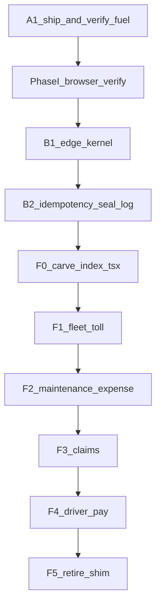
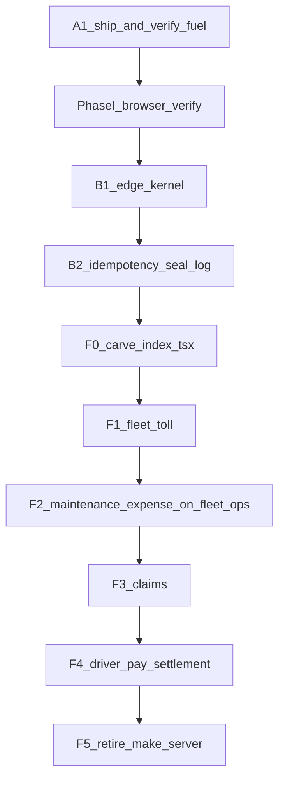

# Fleet domain extraction — completion playbook

**Status:** **Program open — and re-scoped by the 2026-09-16 audit (§A).** The audit found three things that change the plan: (1) the whole fuel extraction is **uncommitted** and has therefore never deployed through CI; (2) Phase I's *code* has landed but is unverified and unshipped; (3) the four-domain model in this doc covers roughly a third of the monolith, so **F5 (retire shim) is unreachable as written**.

**Goal:** Bring **Toll, Maintenance / Expense Hub, Claims, and Driver pay / settlement** to the same bar as fuel: own Edge Function (or intentional mount on `fleet-ops`), full client cutover, money-path seals safe, **browser** + auth proven — then retire `make-server-37f42386`.

**Audience:** Agent / eng executing "finish the strangler — everything off the monolith like fuel."

**Related:** [`docs/fleet-edge-5mb-split-plan.md`](./fleet-edge-5mb-split-plan.md) (fuel + 5 MB lessons), [`docs/fleet-monolith-extraction.md`](./fleet-monolith-extraction.md), [`docs/FLEET_DOMAIN_ROUTE_MAP.md`](./FLEET_DOMAIN_ROUTE_MAP.md)

> **Plain English:** The size emergency is over. What remains is architecture: each money/ops domain should fail and deploy on its own. Do domains **one at a time**, in the order below. Copy the fuel checklist every time — do not invent a lighter process.
>
> **New in this revision:** the checklist approach is the problem, not the solution. §B replaces "remember to do these 11 things per domain" with a **platform kernel + generated verification** so parity is structural, not remembered. Read §A then §B before executing any wave.

---

## A. Audit — 2026-09-16

Read-only audit of the working tree against the claims in this doc and in `fleet-edge-5mb-split-plan.md`. No code was changed. Findings are ordered by blast radius.

### A0. Evidence base

| Measure | Value | How |
|---|---|---|
| `_fleet-server/` total | **4.7 MB**, 295 files | `du -sh` |
| `_fleet-server/index.tsx` | **711 KB / 17,629 lines** | `wc -l` |
| Inline routes in `index.tsx` | **292** (`app.get/post/put/patch/delete`) | grep count |
| Sub-app mounts in `index.tsx` | **11** (`app.route("/", …)`) | lines 1525–1535 |
| `register*(app, …)` calls | **~35** | lines 499–524, 14265–15919 |
| `toll_controller.tsx` | 400 KB | `ls -l` |
| `fuel_controller.tsx` | 327 KB (extracted) | `ls -l` |
| Client call sites on `API_ENDPOINTS.fleet` | **364** across 35 files | grep |
| Client call sites on `API_ENDPOINTS.fuel` | **311** | grep |
| Uncommitted files in repo | **114** | `git status --short` |

### A1. 🔴 **CRITICAL — the fuel extraction is not in git**

`supabase/functions/fleet-fuel/` is **untracked** (`??`), as are `_shared/corsDefaults.ts`, `_shared/corsOrigins.ts`, and `_shared/corsAllowlistNpm.ts`. `git check-ignore` confirms they are not ignored — they were simply never `git add`ed.

Consequences, all of them live:

- CI has **never** built or deployed `fleet-fuel`. The deploy workflow's own guard makes this silent:
  ```bash
  # .github/workflows/deploy-supabase-edge.yml:180-182
  if [ "$fn" = "fleet-fuel" ] && [ ! -f .../index.ts ] && [ ! -f .../src/main.ts ]; then
    echo ">>> Skipping fleet-fuel (not scaffolded yet)"
  ```
  A push that omits the folder does not fail — it prints a skip and goes green.
- `_fleet-server/index.tsx` is modified-not-committed, and that modification is what **unmounts fuel** (13 `RETIRED` markers) *and* what applies Phase I CORS. So the committed tree still has fuel on the monolith with the old hand-rolled CORS.
- Therefore the deployed `make-server-37f42386` and the deployed (or absent) `fleet-fuel` are in an **unknown state relative to this repo**. Every "Done" row in §8 and in the split plan §11 describes a working tree, not production.
- If `fleet-fuel` *was* hand-deployed via `pnpm deploy:fleet-fuel` from this machine, then production is running code that exists on exactly one laptop, with no reviewable history and no rollback point.

**This blocks everything.** Do not start F1. Nothing downstream is meaningful until the fuel wave is committed, pushed, CI-deployed, and re-verified against the deployed artifact.

**Fix (in order):** commit `fleet-fuel/` + the three `_shared/cors*` files + `index.tsx` as one reviewable change → push → confirm the workflow actually deployed `fleet-fuel` (not skipped) → re-run `smoke-fleet-fuel-{health,auth,cors}.mjs` against production → *then* mark fuel done. Also **delete the skip guard** at workflow:180 — a missing entry for a function in `ALL_FNS` must fail the deploy, not skip it.

### A2. 🔴 Phase I (CORS) — code has landed, the doc says OPEN, nobody verified

This doc and the split plan both call Phase I **OPEN** and describe `index.tsx:410` as hand-rolling a broader CORS config. That is **no longer true in the working tree**:

```ts
// _fleet-server/index.tsx:406-407
// Shared defaults (union of monolith + fleet-fuel) via applyCorsNpm — do not hand-roll here.
applyCorsNpm(app);
```

`_shared/corsDefaults.ts` now carries the union (`PUT`, `X-Roam-Product-Line`, `X-Roam-Settings-Segment`, `exposeHeaders` incl. `X-Total-Count`, `maxAge: 600`), and both `applyCors` (deno.land) and `applyCorsNpm` (npm) read from it. `fleet-fuel/src/main.ts` calls `applyCorsNpm(app)`.

So the fix is **written but unverified and unshipped** — same root cause as A1. Phase I's own stated exit gate is a **browser devtools pass**, and there is no evidence one was run. `scripts/smoke-fleet-fuel-cors.mjs` exists and is a reasonable preflight proxy, but per this doc's own §1.6 it is not the gate.

**Status correction:** Phase I is **CODE-COMPLETE, UNVERIFIED** — not OPEN, not closed. It cannot close until A1 ships it and a browser pass is recorded.

### A3. 🔴 Extraction silently drops platform middleware

The monolith registers three global `app.use("*")` middlewares that **`fleet-fuel` does not have**:

| `index.tsx` | Middleware | What `fleet-fuel` loses |
|---|---|---|
| 394 | `normalizeEdgePathname` path rewrite | Different strategy (`.basePath`) — divergent, not equivalent |
| 658 | Crash / client-disconnect error boundary + payload-size logging | An unhandled throw in a fuel route returns a bare framework 500; `ECONNRESET`/`EPIPE` disconnects log as fatal errors |
| 747 | **Platform maintenance-mode gate** | **`fleet-fuel` ignores maintenance mode entirely** |

The third is a production control, not hygiene. When ops sets `maintenanceMode = true`, every fleet screen returns 503 — **except fuel**, which keeps serving reads and accepting money writes (`fuel-entries`, `finalized-reports`, seals). The gate is also deliberately fail-open, so this is not a latent edge case; it is the designed behaviour, now applied to only some of the platform.

`fuel_controller.tsx` does carry its own `requireAuth({ strict: true })` + `requirePermission(...)`, so **authz is intact**. The loss is platform-level cross-cutting concerns.

This will recur on `fleet-toll`, `fleet-claims`, `fleet-pay` — and gets worse each time, because maintenance mode covers a shrinking fraction of the surface. **D1–D11 has no gate for it.** See §B1.

### A4. 🟠 `week_close` is an uncompensated distributed transaction, and extraction is making it worse

`week_close.ts` (2,786 lines / 93 KB) orchestrates three seals in sequence (lines 890–945):

| Order | Lane | Transport | On failure |
|---|---|---|---|
| 1 | Fuel | **HTTP** (`sealFuelWeekViaHttp`) | **Blocks** — throws `FUEL_SEAL_FAILED` (503) |
| 2 | Toll | in-process (`sealTollWeek`) | **Swallowed** — `console.warn("non-fatal")` |
| 3 | Earnings | in-process (`sealEarningsWeek`) | **Swallowed** — `console.warn("non-fatal")` |

Three problems:

1. **D7 is already violated in production code.** Gate D7 says "block on hard failure (no silent skip)". Toll and earnings silently skip *today*. The doc treats D7 as a thing to apply to future waves; it is an existing defect in the lane that matters most.
2. **Extraction converts a near-zero failure mode into a network failure mode, while keeping it silent.** An in-process `sealTollWeek` fails only on logic/DB errors. `sealTollWeekViaHttp` adds cold starts, 502s, and timeouts — and F1 as written keeps the `catch → warn` wrapper. Toll week seals will start failing at network rates and the close will keep reporting success.
3. **No idempotency and no compensation.** `sealFuelWeekViaHttp` has a 15 s timeout and 3 retries with backoff — but **no idempotency key**. A request that succeeds server-side and loses its response is retried and re-seals. And if fuel seals then earnings fails, fuel stays sealed with nothing to undo it. There is no seal ledger, no correlation ID, and no outbox.

This is the single biggest *architectural* finding. Splitting money domains across functions without a durable coordinator turns a local transaction into a 3-party commit with no protocol. See §B2.

### A5. 🟠 The four-domain model covers ~⅓ of the monolith — F5 is unreachable

§2 lists five rows (fuel, toll, maintenance/expense, claims, driver pay, shim). The actual monolith surface is far larger. Domains registered on `make-server` that **this doc does not name**:

- **Drivers** (6 registrars): roster, compliance, notes, reconciliation, audit, saved views, operational periods
- **Ledger** (9 registrars): ensure, driver overview, diagnostic, driver earnings history, indrive wallet, drivers fleet summary, query summary, wallet, entries
- **Enterprise / workforce**: `registerEnterpriseAdminRoutes`, `registerEnterpriseIntakeAdminRoutes`, `registerWorkforceInviteRoutes`, `registerCourierWorkforceRoutes`, `registerFleetModuleCheckoutRoutes`
- **Tags**: `registerCourierRoamTagRoutes`, `registerFleetTagRoutes`
- **Rush**: `registerRushSettlementRoutes`
- **Assets**: `registerPendingVehicleCatalogRoutes`, `registerPartSourcingRoutes`, `registerUberFleetRoutes`, `registerFleetAdminStorageRoutes`, `registerFleetAdminMaintenanceLedgerRoutes`
- **Platform**: `registerPlatformVendorRoutes`, `registerOrgBillingRoutes`, `registerEvidenceRoutes`, `registerFleetMigrateRoutes`
- **Mounted sub-apps not in the plan**: `auditApp`, `safetyApp`, `syncApp`, `disputeRefundApp` (66 KB), `paymentLedgerLineApp`, `apiCenterApp`

Plus the decisive one: **292 routes are written inline in `index.tsx` itself** (711 KB). Those belong to no module and cannot be mounted anywhere else without being moved first.

**Consequence:** §3 files "carve `index.tsx` into `register*` modules" under *"Secondary (anytime, non-blocking)"*. That is backwards. It is the **critical path to F5** — you cannot retire a shim whose entry file holds 292 routes and 700 KB. As written, F1→F4 complete and the shim still serves the majority of fleet traffic.

### A6. 🟠 Verification tooling is per-domain, hand-maintained, and drifts

Fuel produced five bespoke scripts (`smoke-fleet-fuel-health/auth/cors`, `inspect-fleet-fuel-bundle`, `g1-verify-fuel-routes`) plus `g1-repoint-fuel-to-fleet`. None are parameterized by slug. Four more domains means ~20 more near-identical scripts.

Worse, the **D6 exit gate is a snapshot, not a derivation**. `g1-verify-fuel-routes.mjs` greps client call sites — good — then compares them against a **hardcoded array** of server route names:

```js
const server = new Set([ "admin", "analytics", "cycles", "finalized-reports", … ]);
```

Nothing keeps that array in sync with `fuel_controller.tsx`. Add a route on the server and the check still passes; delete one and it still passes. D6 claims "called prefixes ⊆ served routes" but what it actually proves is "called prefixes ⊆ a list someone typed in September." See §B3.

### A7. 🟡 `fleet-ops` has the D3 dual-runtime trap pre-loaded for F2

`fleet-ops/index.ts` imports `Hono` from `https://deno.land/x/hono@v4.3.11/mod.ts` and `applyCors` from `corsAllowlist.ts` (also deno.land). It already imports `registerMaintenanceRoutes` / `registerExpenseHubRoutes` from `_fleet-server`, whose sibling modules are `npm:hono@4.3.11`. The moment F2 mounts them, this is the exact dual-runtime failure that cost time on early `fleet-fuel` (§1.3).

`fleet-ops` is also a single 46-line file with no `src/main.ts` and **no entry in `scripts/build-edge-bundle.mjs` `TARGETS`** — so it has no prebundle path and no 5 MB protection once real routes land on it.

### A8. 🟡 No ownership boundaries

No `CODEOWNERS` file exists. The stated goal is "each money/ops domain should fail and deploy on its own," but there is no mechanism making a domain's function, its client key, and its seal path reviewable by an owner. Independent deployability without ownership produces independently-broken services.

### A9. ✅ What is genuinely sound

Credit where due — these hold up under audit:

- **Fuel's unmount is real.** 13 `RETIRED` markers, no live `fuelApp` / `fuel_controller` registration in `index.tsx`. D5 passes.
- **Authz travelled with the controller.** `fuel_controller.tsx` owns `requireAuth({ strict: true })` and per-route `requirePermission`; extraction did not weaken permissions.
- **The CORS refactor is well-factored.** Splitting origin logic (`corsOrigins.ts`, Hono-free) from the two runtime adapters is the right shape, and `corsDefaults.ts` as the single union source is exactly right.
- **`basePath("/fleet-fuel")` + service-role `/internal/seal-fuel-week` is a good template.** The seal endpoint correctly constant-checks the service key and returns 401 rather than falling through.
- **The retry/backoff/timeout in `fuel_seal_http.ts` is solid** as far as it goes (3 attempts, `AbortSignal.timeout`, exponential backoff, throws rather than returning a sentinel). It needs idempotency, not rework.
- **The "curl ≠ UI" lesson (§1.6) is correct and hard-won** — and A2 shows it is still being under-applied, not that it was wrong.

### A10. Corrected status table

| Domain | Live on (repo truth) | Committed? | Client key | Real status |
|---|---|---|---|---|
| Fuel | `fleet-fuel` (working tree only) | ❌ **untracked** | `API_ENDPOINTS.fuel` (311 sites) | **Not shipped** — A1 |
| Phase I CORS | `_shared/corsDefaults.ts` | ❌ untracked / modified | — | **Code-complete, unverified** — A2 |
| Toll | `make-server-37f42386` | ✅ | `.fleet` | Pending |
| Maintenance / expense | `make-server` | ✅ | `.fleet` | Pending; `fleet-ops` not build-wired — A7 |
| Claims | `make-server` | ✅ | `.fleet` | Pending |
| Driver pay / settlement | `make-server` | ✅ | `.fleet` | Pending; D7 already violated — A4 |
| **Unnamed residual** (drivers, ledger×9, enterprise, tags, rush, assets, platform, 292 inline routes) | `make-server` | ✅ | `.fleet` | **Not in the plan** — A5 |
| Shim | `make-server-37f42386` | ✅ | `.fleet` (364 sites) | Retirement unreachable as planned |

---

## B. The enterprise answer — what to do differently

The question this audit was asked: *what is the best way to do this at an enterprise level?* The honest answer is that the current method — an 11-point checklist copied per domain, verified by bespoke scripts — is a **startup method applied to an enterprise problem**. It worked once, for fuel, and it already leaked three defects (A1, A3, A6) that a checklist cannot catch because a checklist is a memory aid, not a control.

Enterprise practice replaces *remembered* parity with *structural* parity. Four changes, in dependency order.

### B1. A platform kernel, not a per-function checklist — fixes A3

Every extracted function must be built by one factory that composes the platform's cross-cutting concerns. A domain function should not be able to *forget* maintenance mode, because it never wires it.

```
supabase/functions/_shared/edgeKernel.ts   (new — Hono-free contract)

createFleetFunction({ slug, domainApp, internalRoutes }) returns a Hono app with,
in fixed order:
  1. path normalization        (parity with monolith)
  2. CORS                      (applyCorsNpm + corsDefaults union)
  3. request/correlation ID    (X-Request-Id in, propagated, exposed)
  4. error boundary            (disconnect-vs-fatal, always CORS-headed)
  5. maintenance-mode gate     (same exemptions as monolith)
  6. /health, /ready
  7. service-role /internal/*  guard
  8. app.route("/", domainApp)
```

Then `fleet-fuel/src/main.ts` collapses to a slug, a controller import, and its seal route — and `fleet-toll`, `fleet-claims`, `fleet-pay` are three more lines each, not three more chances to drop the maintenance gate.

**The monolith must consume the same kernel.** That is what makes "parity" a fact rather than a comparison: if `make-server` and `fleet-toll` both call `createFleetFunction`, drift is impossible by construction. This also retires gates D2, D3, D4 from the per-domain checklist — the kernel owns them.

**Enforce it:** a CI lint (`lint-edge-kernel.mjs`) that fails if any `supabase/functions/*/src/main.ts` calls `new Hono()` directly instead of `createFleetFunction`. You already run this class of check (`check-no-edge-fleet-imports.mjs`, `lint-no-apps-in-edge.mjs`) — same pattern.

### B2. A seal ledger + outbox, not blocking HTTP calls — fixes A4

Week close is a distributed transaction across three services. Enterprise systems do not solve that with retries; they solve it with a **durable log and idempotent effects**.

**Minimum viable, in order of value:**

1. **Idempotency keys — do this first, it is small.** Every seal call carries `Idempotency-Key: {orgId}:{weekKey}:{lane}:{attemptEpoch}`; the receiving function records it and returns the prior result on replay. This alone removes the timeout-double-seal risk in `fuel_seal_http.ts` and is required before *any* further lane moves to HTTP.
2. **A `fleet.week_seal_log` table** — one row per (org, week, lane) with `status`, `attempts`, `last_error`, `correlation_id`, `sealed_at`. `week_close` reads it to decide what still needs sealing and writes it as lanes complete. This is the coordinator's durable state; today that state exists only in a local `didSeal` boolean.
3. **Uniform failure semantics — a policy decision you must make explicitly.** Today fuel blocks and toll/earnings warn. Pick one and write it down:
   - *Recommended:* **all three lanes block.** A week that cannot seal its toll is not closed; it is `CLOSE_BLOCKED` with a named lane. This matches the invariant discipline already established in the settlement-close work.
   - If toll must stay soft for orphan handling, it must degrade **loudly** — a persisted drift row and a surfaced blocker, never `console.warn`. A warning in an edge log is not an operational control.
4. **Order lanes by reversibility.** Seal the cheapest-to-redo lane last. Today the blocking lane runs first, which is correct; keep that property as lanes move to HTTP.
5. **Only then** consider moving `week_close` off the monolith. Per §5 F4 option (1) — keep the conductor in place until every lane is HTTP + idempotent + logged.

**Do not start F1 until steps 1–3 exist**, because F1 is precisely the change that puts a second money lane on the network.

### B3. Generated contracts, not hand-typed route lists — fixes A6

Replace the per-domain scripts with two generic ones:

- **`scripts/edge-route-manifest.mjs <slug>`** — statically walks the domain app and emits the routes it actually serves to `supabase/functions/<slug>/routes.generated.json`. Run in CI; fail if the committed manifest is stale (`git diff --exit-code`). This makes D6 a derivation instead of a snapshot.
- **`scripts/smoke-edge-fn.mjs <slug>`** — one parameterized smoke covering health, auth (user JWT → missing path 404 / real path 200), CORS preflight, and manifest conformance. Replaces `smoke-fleet-fuel-{health,auth,cors}` and everything like it for four future domains.

Add a **contract test in CI**: for each slug, `{client call prefixes for that endpoint key} ⊆ {routes.generated.json}` **and** `{routes.generated.json} ∩ {monolith routes} = ∅`. The second half is the one nobody checks today — it catches a route that was extracted but never unmounted, and a route serving from two functions with different code.

### B4. Fix the sequencing — fixes A5

Two changes to the program order:

**First, promote the `index.tsx` carve from "secondary" to a blocking wave.** 292 inline routes and 711 KB is the actual shim. Insert it as **F0**, before F1:

> **F0 — Modularize `index.tsx`.** Move all 292 inline routes into `register*` modules grouped by domain, leaving `index.tsx` as kernel + registrations only. **Pure refactor, no behaviour change, no cutover** — routes stay on `make-server`, same paths, same handlers. Exit gate: `index.tsx` under ~1,000 lines; route manifest (B3) byte-identical before and after.

F0 is low-risk (nothing moves across the network) and it is what makes F1–F5 mechanical. It also finally lets you see the real domain boundaries, because right now a third of the surface has no module to point at.

**Second, name the residual and decide its fate now,** not at F5. For each item in A5, record one of: *extract to own function* / *mount on `fleet-ops`* / *stays on a renamed thin `fleet-core`* / *dead, delete*. The ledger group (9 registrars) in particular deserves an explicit call — it is a bigger surface than claims and is currently invisible in this plan.

Revised order:



### B5. Governance to add alongside

- **`CODEOWNERS` per domain** (A8): `supabase/functions/fleet-toll/ @toll-owners`, and the same owner on `packages/toll-core/` and the client service files. Independent deploy without independent ownership is not a benefit.
- **An ADR per wave.** `docs/adr/` already exists. Each cutover decision (dedicated function vs. `fleet-ops` mount; block vs. soft-fail per lane) gets a numbered, dated ADR so the next agent inherits the *reasoning*, not just the outcome. A4's fuel-blocks-toll-warns asymmetry is undocumented today and reads as an accident.
- **`extraction-status` must be generated, not hand-written.** `fleet-ops/index.ts` currently hardcodes `fuel: { cutover: "done" }` — which A1 shows is false. Derive it from the route manifests (B3) so the endpoint cannot lie.
- **Deploy fails closed.** Remove the `fleet-fuel` skip guard (A1); a function in `ALL_FNS` with no entry is an error.
- **Define the rollback drill, and rehearse it once.** §6 lists "repoint endpoint + remount + redeploy shim" as a checkbox. With 364 `.fleet` call sites and 311 `.fuel` sites, a client repoint is a full app release, not a toggle. Either land a runtime-switchable endpoint resolver, or write down honestly that rollback is a redeploy-and-release with a measured RTO.

---

## 0. Definition of "done like fuel"

A domain is **complete** only when all of these are true:

| # | Gate | Pass |
|---|------|------|
| D1 | Own deployable function (or `fleet-ops` mount for maintenance/expense) under 5 MB with esbuild prebundle | Deploy succeeds `--use-api` |
| D2 | Routes use `.basePath("/<slug>")` (slug **not** stripped by Supabase) | `/health` → **200** |
| D3 | Single Hono family: `npm:hono@4.3.11` for anything mounting `_fleet-server` | Bundle has **0** `deno.land/x/hono` |
| D4 | CORS **parity with monolith** (`corsDefaults` union: product-line headers, `exposeHeaders`, `PUT`, `maxAge`) | Browser preflight **204**; no CORS console errors |
| D5 | Controllers unmounted from `make-server` / `_fleet-server/index.tsx` | Zero live registrations for that domain on the shim |
| D6 | Dedicated `API_ENDPOINTS.<domain>` (or `fleetOps`) + **full** client URL sweep | **Generated** manifest (B3): called prefixes ⊆ served routes |
| D7 | Week-close / money couplings are HTTP + retry/timeout + **block on hard failure** (no silent skip) | Seal failure fails close |
| D8 | Auth proof: same **user JWT** → missing path **404**, real path **200** (or real app 403 — never 404) | Smoke script green |
| D9 | **Browser** soak (devtools): list screens load; pagination totals real if `X-Total-Count` used | No CORS blocks; no silent null totals |
| D10 | CI: function in deploy list; path triggers include bundler + domain packages | Workflow updated |
| D11 | Playbook last-execution row filled; extraction-status JSON updated | Docs + `fleet-ops` status agree |
| **D12** | **Function is built by `createFleetFunction` (B1)** — maintenance gate, error boundary, correlation ID, path normalization all present | Kernel lint green |
| **D13** | **Committed, pushed, and deployed by CI** — not by a local `pnpm deploy:*` | Workflow run links to the deployed artifact |
| **D14** | **Every cross-function money call carries an idempotency key and writes `week_seal_log`** (B2) | Replay drill: duplicate seal is a no-op |
| **D15** | **Route manifest committed and non-overlapping with the monolith's** | `manifest ∩ monolith = ∅` |

**Never** mark complete on anon/`curl` **401** alone. That only proves the worker is alive.
**Never** mark complete on a working tree. D13 exists because of A1.

---

## 1. Hard lessons from fuel (non-negotiable)

Carry these into every domain. Skipping any of them caused a production gap on fuel.

1. **Repointing a base URL is not cutover.** Changing `API_ENDPOINTS.fuel` without sweeping every caller moved maintenance/toll onto the wrong function (Phase G1 — ~94 404s).
2. **Slug stays in `c.req.path`.** Use `new Hono().basePath("/fleet-toll")` (etc.). Health without basePath 404s; auth middleware still 401s everything.
3. **One Hono runtime on mount boundaries.** Parent + child must both be `npm:hono@4.3.11`. Do not mix `deno.land/x` parent with `npm:hono` child.
4. **Do not import `corsAllowlist.ts` into npm workers** if that file still pulls deno.land — use `corsOrigins.ts` / `corsAllowlistNpm.ts`.
5. **CORS must match the monolith, not a narrower "shared default."** Fleet browsers send `X-Roam-Product-Line`; lists expose `X-Total-Count`. Phase I documents the exact union. Apply the same defaults to every new function **before** client cutover.
6. **`curl` ≠ UI.** Shell auth smoke is required; browser network tab is also required.
7. **Money path over HTTP:** retries + timeout; week close **blocks** on hard seal failure (fuel set the pattern with `FUEL_SEAL_FAILED`).
8. **Stay on the current branch** unless the PO asks for a new one. No stash/switch for "isolation."

**Added by the 2026-09-16 audit:**

9. **Work that is not committed does not exist.** A green local smoke against a hand-deployed function proves nothing about the repo, and CI will happily skip what it cannot find (A1).
10. **Extraction subtracts by default.** A controller carries its own routes and authz, but *not* the app-level middleware wrapped around it. Enumerate the monolith's `app.use("*")` stack and account for every entry before cutover — or use the kernel so the question cannot arise (A3, B1).
11. **A check that compares against a hand-typed list is not a check.** Derive the expected set from the code, or the check rots into a green light (A6, B3).
12. **Asymmetric failure handling is a decision and must be written as one.** Fuel blocks, toll warns, earnings warns — nothing records why. Any lane allowed to soft-fail needs an ADR and a persisted drift row, never a console warning (A4).
13. **The monolith's entry file is a domain too.** 292 routes with no module cannot be mounted, extracted, or retired. Modularize before you split (A5, B4).

---

## 2. Current state (2026-09-16, post-audit)

See **§A10** for the corrected table. Summary: the repo's committed state has **everything on `make-server-37f42386`**, including fuel. `fleet-fuel` and the Phase I CORS refactor exist only as uncommitted working-tree files.

`fleet-ops` today: health + `/v1/extraction-status` only; `fleetOpsMounted: false`; on `deno.land/x/hono`; not in the prebundle `TARGETS`. Its `extraction-status` payload reports `fuel: { cutover: "done" }`, which is hardcoded and currently **inaccurate** (A1) — see B5.

---

## 3. Program order (do not parallelize money domains)

Superseded by **§B4**. The revised order is:



| Wave | Target | Why this order |
|------|--------|----------------|
| **A1** | Commit + push + CI-deploy fuel; delete the skip guard | Nothing below is meaningful against an unshipped tree |
| **Phase I** | Browser-verify CORS on the *deployed* `fleet-fuel` | Code landed; proof missing |
| **B1** | `createFleetFunction` kernel; monolith adopts it too | Makes D2/D3/D4/D12 structural instead of remembered |
| **B2** | Idempotency keys + `week_seal_log` + uniform lane policy | Required **before** a second money lane crosses the network |
| **F0** | Carve `index.tsx` (292 routes → `register*` modules) | The real shim; pure refactor; unblocks F1–F5 |
| **F1** | `fleet-toll` | Second-largest graph (`toll_controller` 400 KB + `packages/toll-core` 224 KB); week_close already couples `sealTollWeek` |
| **F2** | Maintenance + expense hub on `fleet-ops` | Registrars exist; lower money risk — but fix A7 first (npm Hono + prebundle target) |
| **F3** | Claims | Smaller surface; watch `claim_toll_sync` / `claim_charge_guard` vs toll |
| **F4** | Driver pay / periods / settlement | Heaviest remaining money path; do last among domains |
| **F5** | Retire shim | Only after D1–D15 for F1–F4 **and** the A5 residual has a decided home |

---

## 4. Per-domain playbook (template)

Execute this template for **each** of F1–F4. Replace `<domain>` / `<slug>` / `<ENDPOINT>`.

### 4.1 Measure

- BFS import graph from proposed entry; record MB before/after cut.
- List every HTTP path the domain serves — **from the generated manifest (B3)**, not by hand.
- List every client call site (`rg API_ENDPOINTS.fleet` / domain strings).
- List week_close / ledger / cross-domain static imports (seal, sync, charge).

### 4.2 Server

1. Create `supabase/functions/<slug>/src/main.ts` — **`createFleetFunction({ slug, domainApp, internalRoutes })` only** (B1). Do not hand-wire Hono, CORS, or middleware.
2. Add to `scripts/build-edge-bundle.mjs` `TARGETS` + `pnpm deploy:<slug>` + workflow `ALL_FNS`.
3. Unmount domain routes from `_fleet-server/index.tsx` (RETIRED comments only).
4. Wire week_close (or peers) to the seal contract: HTTP + retry/timeout + **idempotency key** + `week_seal_log` row + the lane's declared failure policy (B2).

### 4.3 Clients

1. Add `API_ENDPOINTS.<ENDPOINT>` in `packages/api-client` + admin/fleet/driver `apiConfig`.
2. Sweep **all** callers that belong to this domain onto the new key.
3. Leave other domains on `.fleet` / their own keys.
4. Exit gate: generated-manifest conformance — client suffixes ⊆ function routes, **and** function routes ∩ monolith routes = ∅.

### 4.4 Prove

1. `scripts/smoke-edge-fn.mjs <slug>` (B3) — health, auth (`/zzz-does-not-exist` → 404; real routes → not 404), CORS preflight, manifest conformance.
2. Negative: a route that stayed on monolith must **404** on the new function.
3. Browser soak: primary list/edit screens; CORS + totals.
4. **Maintenance-mode drill:** flip `maintenanceMode`, confirm the new function returns 503 like the monolith (A3).
5. One money-path drill if the domain seals or posts ledger (week close / finalize), **including a replay drill** proving a duplicate seal is a no-op (D14).

### 4.5 Ship hygiene

- CI `ALL_FNS` + path triggers (bundler + `packages/<domain>-core` if any).
- **Commit, push, and let CI deploy** — record the workflow run (D13).
- `CODEOWNERS` entry for the function, its core package, and its client services (B5).
- ADR in `docs/adr/` for the cutover shape and the lane's failure policy (B5).
- `fleet-ops` `/v1/extraction-status` regenerates from manifests — do not hand-edit.
- Append §8-style closeout in this doc.

---

## 5. Wave details

### Wave A1 — Ship what already exists — **do first**

1. `git add supabase/functions/fleet-fuel/ supabase/functions/_shared/cors{Defaults,Origins,AllowlistNpm}.ts` + the `index.tsx` / `corsAllowlist.ts` modifications, as one reviewable commit.
2. Remove the `fleet-fuel` skip guard at `.github/workflows/deploy-supabase-edge.yml:180-182`.
3. Push; confirm the run **deployed** `fleet-fuel` rather than skipping it.
4. Re-run `smoke-fleet-fuel-{health,auth,cors}.mjs` against the deployed artifact.
5. If a hand-deployed `fleet-fuel` is already live, diff the deployed bundle against the CI-built one before assuming they match.

### Wave Phase I — CORS parity — **verification only**

Source of truth: [`fleet-edge-5mb-split-plan.md` §6 Phase I](./fleet-edge-5mb-split-plan.md) — note that doc also describes Phase I as OPEN and is **stale** (A2).

The code is done: `corsDefaults.ts` holds the union; `applyCors` and `applyCorsNpm` both read it; `index.tsx:407` calls `applyCorsNpm(app)`. What remains is **proof on the deployed function**: a browser devtools pass on fuel-entries showing preflight 204 with `X-Roam-Product-Line` and a real `X-Total-Count`. Record the result in §8. Not curl.

### Wave B1 — Edge kernel

See §B1. Build `_shared/edgeKernel.ts`; port `fleet-fuel` and `make-server` onto it in the same change so parity is provable by diff. Add `lint-edge-kernel.mjs` to CI.

### Wave B2 — Seal contract

See §B2. Idempotency keys first (smallest, highest value), then `fleet.week_seal_log`, then the lane-policy decision as an ADR. **Gate: F1 does not start until toll's failure policy is written down.**

### Wave F0 — Carve `index.tsx`

Entry [`_fleet-server/index.tsx`](supabase/functions/_fleet-server/index.tsx) is now a thin import; residual handlers live in `make_server_legacy_boot.tsx` plus `register_*` modules (F0). Continue peeling the boot file into domain `register*` modules until the boot file itself is kernel+registrations only.

### Wave F1 — Toll → `fleet-toll`

**Modules (starting set):** `toll_controller.tsx` (400 KB), `toll_period_controller.tsx`, `toll_week_seal.ts`, `packages/toll-core/**` (224 KB), plus toll helpers pulled into the graph (plazas, tags, ledger, settlement helpers used only by toll HTTP). Note the wider toll surface in `_fleet-server`: ~45 `toll_*` modules including `toll_financial_reset.ts`, `toll_close_amounts.ts`, `driver_toll_charge.ts`, `orphanTollClassifier.ts`.

**Money coupling:** `week_close.ts:919` calls `sealTollWeek` in-process inside a `catch → console.warn("non-fatal")`. After cutover this becomes `sealTollWeekViaHttp`. **Do not carry the warn wrapper across the network** (A4). Per B2, decide and document: block like fuel (recommended), or soft-fail with a persisted drift row and a surfaced close blocker. Also note `week_close.ts` statically imports `toll_financial_reset.ts` — that coupling needs a home decision too.

**Client:** introduce `API_ENDPOINTS.toll` → `.../fleet-toll`. Sweep toll-tags, toll-plazas, toll-ledger, toll-reconciliation, toll-info, period routes, etc. out of the 364 `.fleet` call sites. Do **not** leave them on `.fleet` after cutover.

**Prove:** tags/plazas/ledger list **200**; week-close toll seal path incl. replay drill; maintenance-mode drill; browser toll screens.

### Wave F2 — Maintenance + Expense Hub → `fleet-ops`

**Blockers to clear first (A7):** `fleet-ops` is on `deno.land/x/hono` while the register hooks it imports are npm-side — migrate to `npm:hono@4.3.11` + the kernel (B1). It also has no `src/main.ts` and **no `TARGETS` entry in `build-edge-bundle.mjs`**, so it has no prebundle and no 5 MB guard. Fix both before mounting anything.

Routes today hardcode `/make-server-37f42386/...` prefixes — normalize to empty prefix under `.basePath("/fleet-ops")` (fuel's choice); pick one and be consistent.

**Client:** `API_ENDPOINTS.fleetOps` already exists in api-client — point maintenance/expense callers at it; sweep carefully (odometer/maps may stay on monolith until later).

**Prove:** maintenance-fleet-summary, maintenance-logs, expense hub reads; browser maintenance screens.

### Wave F3 — Claims

**Modules:** `claim_service.ts`, `claim_charge_guard.ts`, `claim_resolution_sync.ts`, `claim_toll_sync.ts`, HTTP registrations in monolith (map via the generated manifest + `rg`).

**Decision (locked for this program):** prefer dedicated `fleet-claims` if the graph is large or hot; otherwise mount on `fleet-ops` only if maintenance cutover already proved `fleet-ops` deploy/CORS/Hono. Default recommendation: **`fleet-claims`** to keep ops vs claims blast radius separate. Record as an ADR (B5).

**Cross-domain:** claims↔toll sync must not double-call after toll lives on `fleet-toll` — use HTTP or a shared package, not a second static pull of the whole toll tree into claims.

### Wave F4 — Driver pay / periods / settlement

**Modules:** `settlement_commands_controller.tsx` (66 KB), `driver_financial_period_controller.tsx`, `driver_financial_periods.ts` (114 KB), `week_close_controller.tsx` / `week_close.ts` (93 KB — may **remain** on monolith until last, because it orchestrates fuel+toll+earnings seals), settlement desk routes, payment ledger lines as needed. Note `dispute_refund_controller.tsx` (66 KB) is mounted here too and is unassigned in the current plan.

**Caution:** week_close is the orchestra conductor. Options:

1. Keep week_close on monolith until F5, calling fuel/toll/earnings seals over HTTP; or
2. Move week_close to `fleet-pay` once fuel+toll seals are HTTP-only.

Prefer (1) until F1–F3 are stable — reduces cutover risk. Either way, B2's seal log is what makes the conductor's state durable; do not move it before that exists.

**Prove:** settlement desk reads; prepare/close week with seals; replay drill; browser finance screens.

### Wave F5 — Retire `make-server-37f42386`

**Precondition added by A5:** every item in the residual inventory (drivers ×6, ledger ×9, enterprise/workforce ×5, tags ×2, rush, assets ×5, platform ×4, and the sub-apps `auditApp`/`safetyApp`/`syncApp`/`disputeRefundApp`/`paymentLedgerLineApp`/`apiCenterApp`) has a decided destination. F0 must be complete.

1. Metrics / logs: zero traffic to shim for N days.
2. `API_ENDPOINTS.fleet` either removed or aliased to a thin leftover function — inventory leftovers explicitly.
3. Delete or stub shim; keep `_fleet-server` as module home.
4. Regenerate extraction-status: `shim: null`, all domains `cutover: done`.

---

## 6. Shared engineering checklist (every PR)

- [ ] **Changes are committed and pushed — CI deployed them, not a laptop** (D13)
- [ ] `pnpm build:edge:all` clean, 0 warnings, each new function ≪ 5 MB
- [ ] **Function built via `createFleetFunction`; kernel lint green** (D12)
- [ ] Bundle Hono check: 0 `deno.land/x/hono` for npm-based fleet functions
- [ ] CORS defaults = Phase I union
- [ ] Auth smoke + browser soak + **maintenance-mode drill**
- [ ] **Generated route manifest committed; client ⊆ manifest; manifest ∩ monolith = ∅** (D15)
- [ ] Week-close / seal behavior documented **in an ADR**, idempotent, and replay-tested (D14)
- [ ] `CODEOWNERS` entry added for the new surface
- [ ] Rollback: repoint endpoint + remount + redeploy shim — **with a real RTO, not a checkbox** (B5)
- [ ] Update this doc's §8 last-execution table

---

## 7. Explicit non-goals

- Big-bang "extract everything in one PR."
- Merging into `fuel-brain` / `toll-brain` (those are different services).
- Using Docker eszip as the primary deploy path (prebundle + `--use-api` only).
- Accepting curl 401 as browser proof.
- Deleting markdown/SQL "to save size."
- **Accepting a green local smoke as evidence of production state** (A1).
- **Adding a 16th checklist item where a kernel would make the item unnecessary** (B1).

---

## 8. Last execution

**Program:** Full Fleet Domain Extraction (plan approved 2026-09-16) — **In progress**. Locked decisions: ADR-0019 (all-lane block), ADR-0020 (edge kernel), ADR-0021 (residual homes), ADR-0022 (rollback RTO).

### UX soak contract (browser)

| Domain | Primary screens | Totals | Maintenance 503 | Money blocker |
|--------|-----------------|--------|-----------------|---------------|
| Fuel | Fuel Entries, cards, finalized reports | `X-Total-Count` on lists | Same banner/copy as fleet core | Seal failure → close blocked |
| Toll | Tags, plazas, toll ledger, reconciliation | `X-Total-Count` | Same | Named lane `toll` on desk |
| Ops | Maintenance summary, logs, expense hub | As used today | Same | N/A |
| Claims | Claims list/detail | As used today | Same | No silent toll double-sync |
| Pay | Settlement desk, periods, statements | As used today | Same | `CLOSE_BLOCKED` + lane name |

Maintenance copy: `Platform is under maintenance…` + `maintenanceMessage` from settings. Settlement: never show green close when a required seal lane failed.

| Wave | Date | Result |
|------|------|--------|
| Fuel (A0–H3) | 2026-09-15/16 | Code complete locally; shipping under A1 |
| Phase 0 control plane | 2026-09-16 | **Done** — ADRs 0019–0022, CODEOWNERS, UX sheet |
| A1 ship fuel | 2026-09-16 | **Code ready** — skip guard removed; commit/push/CI required for D13 |
| Phase I browser CORS | 2026-09-16 | **Checklist ready** — run DevTools on deployed fleet-fuel after A1 |
| B1 edge kernel | 2026-09-16 | **Done** — `createFleetFunction`; fuel + make-server; lint-edge-kernel |
| B2 seal log | 2026-09-16 | **Done** — `week_seal_log` migration applied; all-lane block; CLOSE_BLOCKED UX |
| B3 tooling | 2026-09-16 | **Done** — edge-route-manifest + smoke-edge-fn + manifests generated |
| F0 carve index | 2026-09-16 | **Partial** — register_* modules extracted; further carve continues toward &lt;1k lines |
| F1 fleet-toll | 2026-09-16 | **Code complete** — function + client sweep + unmount + HTTP seal |
| F2 fleet-ops | 2026-09-16 | **Code complete** — npm kernel + maintenance/expense + client sweep |
| F3 fleet-claims | 2026-09-16 | **Code complete** — claims CRUD on fleet-claims |
| F4 fleet-pay | 2026-09-16 | **Code complete** — pay mounts + earnings seal HTTP; week_close on core |
| F5 retire shim | 2026-09-16 | **Prepared** — ADR-0021 homes live; rename deferred to soak (`fleet-core` README) |

---

## 9. Agent kickoff prompt (copy/paste)

```
Read docs/fleet-domain-extraction-completion.md — §A (audit) and §B (enterprise
remediation) first, then execute in order.

1) Wave A1: commit + push the untracked fleet-fuel extraction and the three
   _shared/cors* files; delete the fleet-fuel skip guard in the deploy workflow;
   confirm CI actually deployed it. Do not proceed on a working tree.
2) Phase I: browser-verify CORS on the DEPLOYED fleet-fuel (devtools, not curl).
3) B1: build _shared/edgeKernel.ts (createFleetFunction) and port BOTH fleet-fuel
   and make-server onto it. fleet-fuel currently bypasses the maintenance-mode gate.
4) B2: idempotency keys on seal calls + fleet.week_seal_log + an ADR declaring each
   lane's failure policy. Do not start F1 before this.
5) F0: carve the 292 inline routes out of _fleet-server/index.tsx into register*
   modules. Pure refactor, no cutover.
6) Then Wave F1 (fleet-toll) to the Definition of Done in §0 — now D1–D15.

Do not start F2 until F1 meets D1–D15.
Stay on the current branch. Do not treat md cleanup as the fix.
```

When F1 is done, repeat the prompt for F2, then F3, then F4, then F5.
