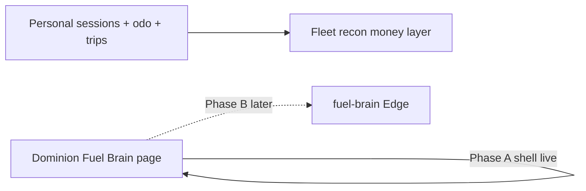

# Fuel Brain — Phase A (evidence first)

## Goal

Make **personal use measurable or declared**, and give Fuel Brain a home in Dominion. Do **not** build the live classifier yet (that is Phase B).

## Architecture (locked)

- **Dominion** owns the brain UI (stubbed: `fuel-brain` under Fuel Management).
- **Fleet / Driver** capture evidence in Phase A.
- **Edge classifier + `FLEET_USE_FUEL_BRAIN`** = Phase B.

Draw.io (5 tabs): [fuel-brain-architecture.drawio.xml](./fuel-brain-architecture.drawio.xml)

---

## Phase A scope

### 1. First-class personal sessions

Durable event model (`fuel_driving_session` / `FuelPersonalSession`):

- `driverId`, `vehicleId`, `startAt`, `endAt` (or open session)
- `mode`: `personal` | `off_duty` | `work`
- `source`: `driver_toggle` | `driver_declare` | `admin_override`
- `confidence`: high when toggle timed; medium when post-hoc declare
- Optional start/end odometer

Wire:

- Driver app: **Personal / Off-duty** toggle while using company vehicle
- After long offline / inter-trip gaps: prompt **Declare personal vs work**
- Fleet admin: view + override sessions for a week

### 2. Stop residual = Personal (bridge rule)

In Fleet `fuelCalculationService` weekly path:

- Prefer **declared personal session km** (intersected with odometer windows) for `personalDistance`
- Remaining unexplained residual → **`unknownKm`** (metadata), **not** automatic Personal
- Deadhead heuristic only on residual still unexplained after declared personal
- Recon UI: show Unknown / gate finalize so operators see the gap

### 3. Unify ride-share km definition

One shared helper for trip km used by recon **and** deadhead server path (same segments — prefer full rideshare stack to match current recon; update deadhead API to match).

### 4. Dominion Fuel Brain page (expand stub)

Already at:

- Nav: Fuel Management → **Fuel Brain**
- Page: `apps/admin/src/components/admin/fuel-brain/FuelBrainPage.tsx`

Phase A UI additions:

- Deadhead gap thresholds (document + store; Edge uses in Phase B)
- Evidence health for a sample week (% declared personal coverage)
- Link to Fleet recon

### 5. Feature flags

- `FUEL_PERSONAL_SESSIONS_ENABLED` (driver/fleet evidence)
- Keep `FLEET_USE_FUEL_BRAIN` **off** until Phase B

---

## Explicit non-goals (Phase A)

- Live Edge classifier
- Replacing recon category $ math
- GPS telematics / geofences (Phase C)
- Changing policy % splits

---

## Done when

- Driver can start/stop Personal mode and it appears on that driver-week
- Unexplained residual no longer silently becomes Personal
- Dominion shows Fuel Brain under Fuel Management
- Ride-share km definition is consistent client ↔ deadhead
- Phase B can consume sessions without rewriting money layer

---

## Suggested build order

1. Session type + API persist
2. Driver toggle + declare prompt
3. Recon consume sessions + Unknown residual
4. Unify trip km helper
5. Expand Dominion Fuel Brain stubs (rules placeholders)
