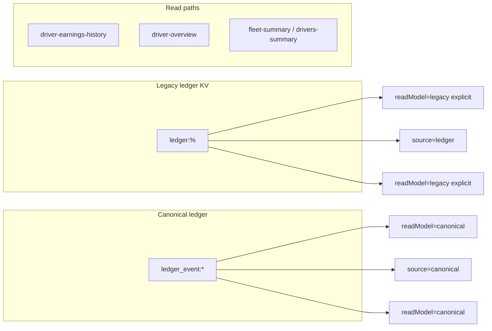

# Canonical takeover — phased implementation (safety-first)

**Scope:** Rollout from inventory → shadow diffs → fix gaps → switch reads → stop writes → backfill/archive → remove fallbacks.

**Source of truth:** This file plus [`docs/LEDGER_LEGACY_INVENTORY.md`](../docs/LEDGER_LEGACY_INVENTORY.md).

## Key code touchpoints

- Legacy reads/writes: [`supabase/functions/server/index.tsx`](./supabase/functions/server/index.tsx) (`generateTripLedgerEntries`, `GET /ledger/*`, repair/backfill routes) and [`services/api.ts`](./services/api.ts).
- Canonical aggregation: [`utils/ledgerMoneyAggregate.ts`](./utils/ledgerMoneyAggregate.ts), `aggregateCanonicalEventsToLedgerDriverOverview` (server: [`ledger_money_aggregate.ts`](./supabase/functions/server/ledger_money_aggregate.ts)). Fleet/drivers period aggregation uses shared **`aggregateFleetSummaryFromLedgerLikeEntries`** plus canonical paginated fetches on the server.
- **Client (Phase 8):** No feature flags — money views call ledger APIs without `readModel` / `source` (server defaults to **`ledger_event:*`**). Emergency rollback only via **explicit** query params on the API (`readModel=legacy`, `source=ledger`).
- UI: [`DriverDetail.tsx`](./components/drivers/DriverDetail.tsx), [`DriverEarningsHistory.tsx`](./components/drivers/DriverEarningsHistory.tsx), [`Dashboard.tsx`](./components/dashboard/Dashboard.tsx) (fleet summary), [`DriversPage.tsx`](./components/drivers/DriversPage.tsx) (drivers summary).

---

## Phase 0 — Preflight, backups, and rules of engagement

**Goal:** Nothing moves until backups and ownership are clear.

**Steps:**

1. **Database backup:** Full Supabase (or host) backup of the project that holds KV / `kv_store_*`; store offline with date stamp.
2. **Logical exports:** Data Center / Trip Ledger / toll exports — CSVs for trips, tolls, transactions for a wide date range.
3. **Freeze window (optional):** Short window where bulk deletes / re-imports are avoided during shadow and cutover.
4. **Rollback principle:** Prefer **API** query params (`readModel=legacy`, `source=legacy` / `source=ledger`) for read rollback; client toggles were removed in Phase 8.
5. **Exit criteria:** Backups verified restorable or exports verified complete; stakeholders acknowledge freeze rules.

---

## Phase 1 — Inventory: every reader and writer of `ledger:%`

**Goal:** Written register so nothing is starved when writes stop.

**Deliverable:** [`docs/LEDGER_LEGACY_INVENTORY.md`](../docs/LEDGER_LEGACY_INVENTORY.md).

---

## Phase 2 — Shadow comparison infrastructure

**Goal:** Server compares legacy vs canonical fare gross per bucket; logs when enabled.

**Implementation (in repo):**

- `GET /ledger/driver-earnings-history` supports **`shadowCompare=1`**. Server logs **`[LedgerEarningsShadow]`** (legacy vs canonical fare gross per period when both paths can be evaluated).

**Operational:** Sample in staging/production logs before relying solely on canonical numbers.

---

## Phase 3 — Fix canonical and data gaps

**Goal:** Reduce trip roll vs statement and missing events — **data/process**, not only code.

**Steps:** Re-run imports, use diagnostics (`GET /ledger/diagnostic-trip-ledger-gap`, in-app tools). Legacy repair writes are retired — use canonical append / import paths.

---

## Phase 4 — Switch reads: driver earnings history (canonical)

**Goal:** Earnings / payout views can use **`ledger_event:*`**.

**Implementation (in repo):**

- **`GET /ledger/driver-earnings-history?readModel=canonical`** — buckets from **`ledger_event:*`** (multi-driver ID resolution), same period math as legacy.
- **API default when param omitted:** **`readModel=canonical`**.
- [`DriverEarningsHistory`](./components/drivers/DriverEarningsHistory.tsx), [`useDriverPayoutPeriodRows`](./hooks/useDriverPayoutPeriodRows.ts), [`SettlementSummaryView`](./components/drivers/SettlementSummaryView.tsx) call the API without **`readModel`** (canonical default).

---

## Phase 5 — Switch reads: fleet summary, drivers summary

**Goal:** Dashboard and drivers list financial aggregates can use canonical events.

**Implementation (in repo):**

- **`GET /ledger/fleet-summary?readModel=canonical`** — loads **`ledger_event:*`** in the date window, then **`aggregateFleetSummaryFromLedgerLikeEntries`** (same shape as legacy aggregation).
- **`GET /ledger/drivers-summary?readModel=canonical`** — all **`fare_earning`** rows from **`ledger_event:*`**, same per-driver lifetime / month / today buckets as legacy.
- **API default when param omitted:** **`readModel=canonical`**.
- **Client:** [`Dashboard.tsx`](./components/dashboard/Dashboard.tsx) and [`DriversPage.tsx`](./components/drivers/DriversPage.tsx) omit **`readModel`** (canonical default). **`driver-overview`:** [`DriverDetail`](./components/drivers/DriverDetail.tsx) omits **`source`** (canonical default).

**Not done (full “legacy extinction”):** legacy **`ledger:%`** rows, write paths, and admin tooling — see **Remaining work** below.

---

## Phase 6 — Stop new writes to `ledger:%`

**Goal:** No new rows in **`ledger:%`** once env is flipped; money events use **`ledger_event:*`** (append API, imports, etc.).

**Server env (legacy):** **`LEGACY_LEDGER_WRITES`** is no longer read — code always treats legacy writes as disabled.

**Implementation (in repo):** Helper **`legacyLedgerWritesDisabled()`** always **`true`**:

- **`generateTripLedgerEntries`** — returns `[]` (no trip-sourced fare rows).
- **`buildUberFareEarningFallbackEntriesIfEligible`** — returns `[]` (no Uber fallback rows).
- **`generateTransactionLedgerEntry`** — returns **`null`** (no transaction → legacy fuel/expense rows).
- **`POST /ledger`**, **`POST /ledger/batch`**, **`PATCH /ledger/:id`** — **403** with message.
- **`POST /ledger/backfill`** — **403** when **not** dry-run (dry-run still allowed for preview).
- **`POST /ledger/repair-driver-ids`** — **403** when **not** dry-run.
- **`POST /ledger/repair-driver`**, **`POST /ledger/ensure-from-trip-ids`** — **403**.

Trip and fleet sync still **persist trips**; they simply stop writing **`ledger:%`** when the flag is off. **`DELETE /ledger/:id`** remains for admin cleanup of old rows.

**Stop point:** Legacy writes are off in code; deploy Edge so clients receive the updated bundle.

---

## Phase 7 — Optional backfill or read-only archive

**Goal:** Historical periods fully represented in canonical **or** a documented cutoff / archive.

**Steps:** Decide backfill vs cutoff; idempotent keys; legal/ops approval before any purge of **`ledger:%`** keys.

---

## Phase 8 — Remove dual-path UI and flags

**Goal:** Drop **`localStorage` / `VITE_*`** toggles and legacy branches once rollback is no longer required.

**Status (client, in repo):** **`featureFlags.ts`** removed; fleet/drivers/earnings/driver-overview calls use server canonical defaults. **Server** still implements **`readModel=legacy`** / **`source=ledger`** for API-level rollback.

---

## Phase 9 — Verification, monitoring, and handoff

**Steps:**

1. Regression: driver overview, earnings, fleet/drivers summaries, Trip Ledger, Data Center, tolls.
2. Optional ongoing **`shadowCompare=1`** sampling while validating.

### Runbook

| Switch | Effect |
|--------|--------|
| **`GET /ledger/count`** | Canonical **`ledgerEntries`**, trip/transaction counts only (no legacy field). |
| Legacy **write** routes (`POST /ledger`, repair, backfill, etc.) | **403** — use **canonical append** for money events. |
| **`POST /ledger/purge-legacy-all`** | Deletes **all** **`ledger:%`** KV rows (`dryRun` or `confirm: "DELETE_ALL_LEGACY_LEDGER_KV"`); **`data.backfill`** required. **Not** in Delete Center UI — call from API client or **`scripts/purge-legacy-ledger-kv.sql`**. |
| **`scripts/purge-legacy-ledger-kv.sql`** | Optional operator SQL (same end state as **`purge-legacy-all`**). |

**Operator sequence (legacy purge):** (1) backup if desired; (2) deploy Edge; (3) **`POST /ledger/purge-legacy-all`** with confirm, **or** raw SQL — one-time. **Delete Center** now shows canonical counts only; use API/SQL if stray **`ledger:%`** keys ever reappear.

---

## Canonical data verification (after legacy purge)

**Goal:** Money in the UI comes from **`ledger_event:*`**, populated by **Uber (and other) CSV imports** via **canonical append** — not from deleted **`ledger:%`** rows.

**Do this for each import batch you care about:**

1. **Run the merged import** (Uber CSVs through the normal **Data Center → Import** flow). On success, the **Fleet Sync Complete** screen shows **events built**, **appended**, and **skipped** for canonical ledger events.
2. **If reconciliation failed** (toast or red flag on the success card), fix data or CSV coverage before trusting totals; trips may still save without canonical money events.
3. **Delete Center check:** **Imports → Delete** → **Database Record Counts** → **Ledger events (canonical)** should increase after imports (refresh). Legacy should stay **0**.
4. **Spot-check two drivers** for the imported period: open **Drivers →** pick a driver → **earnings / trip ledger** (or your usual money view). Totals should match expectations for that CSV period.
5. **Optional:** sample **`shadowCompare=1`** on **`GET /ledger/driver-earnings-history`** in staging/logs until you trust canonical vs expectations.

**CLI (rough health):** `npm run verify:legacy-ledger` prints canonical / trip / transaction **counts** (not per-driver). Use the app for driver-level verification.

### Date picker: why Roam/InDrive “just work” but Uber can look wrong on a tight range

- **Roam / InDrive (and trip-based parts of the UI):** Period totals use **`trip.date`** with a normal **start–end interval** (`DriverDetail` `metrics` loop). Pick a single day → only trips that day count. No CSV statement semantics.
- **Uber (ledger / canonical):** Driver overview and breakdown use **`ledger_event:*`** filtered by **`canonicalEventInSelectedWindow`** (`ledgerMoneyAggregate.ts`). Event **`date`** may be a **statement posting day**, **period end**, or **outside** a tight range even when trips fell inside it; **statement** rows can also **dedupe** per-trip fare lines when a payments CSV statement is present. So the **same calendar day** can show Roam/InDrive from trips and miss Uber until the range includes the event **`date`** or full statement week (e.g. folder **Mar 23–Mar 30** vs picking **Mar 23–29** only).

---

## Remaining work for full legacy extinction

1. **Done (this repo):** Canonical-only reads; legacy writes no-ops / **403**; **`deleteLedgerEntriesForTripSource`** and **`POST /ledger/purge-orphans`** removed; **`GET /ledger/count`** no legacy field; **`POST /ledger/purge-legacy-all`** added.
2. **Operator (production):** Deploy Edge, then run **`POST /ledger/purge-legacy-all`** once (or equivalent SQL) — irreversible for **`ledger:%`** keys.
3. **Docs:** [`docs/LEDGER_LEGACY_INVENTORY.md`](../docs/LEDGER_LEGACY_INVENTORY.md) updated for the above.
4. **Client types (nice-to-have):** **`LedgerFilterParams`** / **`api.ts`** — removed unused **`source`** / **`readModel`** query params from ledger list, summary, driver-overview, gap diagnostic, InDrive wallet, earnings history, drivers-summary, fleet-summary. Server response may still echo **`readModel: "canonical"`** for compatibility.
5. **Delete Center:** Legacy purge button removed from UI (purge complete); canonical count + short ops note only. **`purge-legacy-all`** remains on the API for edge cases.
6. **Server `index.tsx`:** Read paths and diagnostics now use **`ledger_event:%`** only; legacy **`ledger:%`** scans remain for **`POST /ledger/purge-legacy-all`**, optional legacy **POST /ledger** dedup when writes enabled, and retired write/repair helpers that still target **`ledger:`** keys.

---

## Execution protocol

Large or irreversible changes (bulk **`ledger:%`** purge, production KV deletes) should stay behind explicit approval and monitoring.
