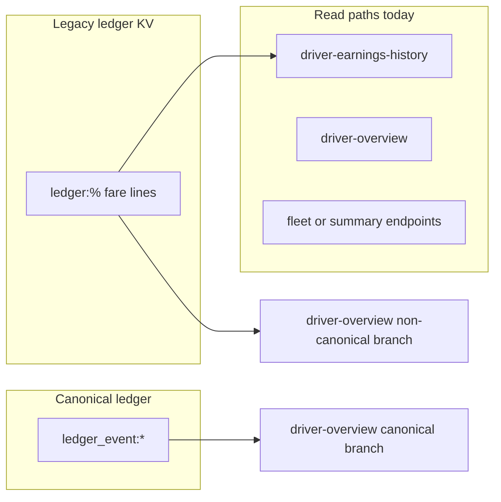

# Canonical takeover — phased implementation (safety-first)

**Scope:** Rollout from inventory → shadow diffs → fix gaps → switch reads → stop writes → backfill/archive → remove fallbacks. **Implementation is gated:** do not start coding a phase until explicitly approved (except documented automation below).

**Source of truth:** This file plus [`docs/LEDGER_LEGACY_INVENTORY.md`](../../docs/LEDGER_LEGACY_INVENTORY.md) (from repo root: `docs/LEDGER_LEGACY_INVENTORY.md`).

## Key code touchpoints

- Legacy reads/writes: [`supabase/functions/server/index.tsx`](../supabase/functions/server/index.tsx) (`generateTripLedgerEntries`, `GET /ledger/driver-earnings-history`, `GET /ledger/driver-overview`, `POST /ledger/repair-driver`, `POST /ledger/backfill`, fleet `ensure-from-trip-ids` via [`services/api.ts`](../services/api.ts)).
- Canonical aggregation: [`utils/ledgerMoneyAggregate.ts`](../utils/ledgerMoneyAggregate.ts), `aggregateCanonicalEventsToLedgerDriverOverview` (server: `ledger_money_aggregate.ts`).
- Client overview flag: [`utils/featureFlags.ts`](../utils/featureFlags.ts) (`isLedgerMoneyReadModelEnabled`), [`components/drivers/DriverDetail.tsx`](../components/drivers/DriverDetail.tsx).
- Earnings UI: [`components/drivers/DriverEarningsHistory.tsx`](../components/drivers/DriverEarningsHistory.tsx).

---

## Phase 0 — Preflight, backups, and rules of engagement

**Goal:** Nothing moves in code until backups and ownership are clear.

**Steps:**

1. **Database backup:** Full Supabase (or host) backup of the project that holds KV / `kv_store_*`; store offline with date stamp.
2. **Logical exports:** Data Center / Trip Ledger / toll exports — CSVs for trips, tolls, transactions for a wide date range.
3. **Freeze window (optional):** Short window where bulk deletes / re-imports are avoided during shadow and cutover.
4. **Rollback principle:** Keep `isLedgerMoneyReadModelEnabled` / env toggles documented as emergency switch for overview reads until Phase 8.
5. **Exit criteria:** Backups verified restorable or exports verified complete; stakeholders acknowledge freeze rules.

**Stop point:** Confirm Phase 0 complete before Phase 1 implementation work.

---

## Phase 1 — Inventory: every reader and writer of `ledger:%`

**Goal:** Written register so nothing is starved when writes stop.

**Deliverable:** [`docs/LEDGER_LEGACY_INVENTORY.md`](../../docs/LEDGER_LEGACY_INVENTORY.md) — table **Consumer | Read/Write | File or route | Risk if turned off**.

**Stop point:** Review inventory before Phase 2.

---

## Phase 2 — Shadow comparison infrastructure (no user-visible change by default)

**Goal:** Server compares legacy vs canonical weekly gross per driver; logs when enabled.

**Implementation (done in repo):**

- `GET /ledger/driver-earnings-history` supports `shadowCompare=1` (optional). When set, server logs `[LedgerEarningsShadow]` lines: `driverId`, `periodStart`, `periodEnd`, `legacyGross`, `canonicalFareGross`, `delta`.
- Controlled logging avoids changing default API response unless `readModel=canonical` is used (Phase 4).

**Steps (operational):**

1. Define comparison unit: `(driverId, weekStart, weekEnd)` for gross from `fare_earning`-style fare (aligned with legacy buckets).
2. Enable shadow in staging/production logs for sampled requests (`shadowCompare=1`).
3. **Exit criteria:** Diffs logged; no change to default JSON for clients that omit flags.

**Stop point:** Monitor before flipping `readModel` default.

---

## Phase 3 — Fix canonical and data gaps

**Goal:** Reduce trip roll vs statement and missing events using imports, Data Center, diagnostics — **data/process**, not only code.

**Steps:**

1. Re-run or fix imports (`payments_driver`, trip UUID alignment).
2. Use `GET /ledger/diagnostic-trip-ledger-gap` and in-app Diagnose / repair where appropriate.
3. Coordinate repair with Phase 6 if repair still writes `ledger:%`.
4. Re-sample shadow after fixes.
5. **Exit criteria:** Agreed delta threshold or explicit sign-off.

**Stop point:** Approve before Phase 4 default cutover.

---

## Phase 4 — Switch reads: driver earnings history to canonical-first

**Goal:** Financials → Earnings uses canonical-backed weekly rows when enabled.

**Implementation (done in repo):**

- `GET /ledger/driver-earnings-history?readModel=canonical` builds buckets from **`ledger_event:*`** (multi-driver ID resolution), same tier/quota math as legacy.
- Client: [`isLedgerEarningsReadModelEnabled()`](./utils/featureFlags.ts) — when true, API passes `readModel=canonical`. Default **false** (legacy) until `VITE_LEDGER_EARNINGS_READ_MODEL=true` or `localStorage` `roam_ledger_earnings_read_model` = `1`.
- [`DriverEarningsHistory`](./components/drivers/DriverEarningsHistory.tsx), [`useDriverPayoutPeriodRows`](./hooks/useDriverPayoutPeriodRows.ts), [`SettlementSummaryView`](./components/drivers/SettlementSummaryView.tsx) use the same flag.
- Legacy remains default: `readModel=legacy` or omit param.

**Stop point:** Enable client flag in prod after shadow is acceptable; monitor 1–2 releases before Phase 5.

---

## Phase 5 — Switch reads: fleet summary, drivers summary, legacy `driver-overview` branch

**Goal:** Dashboard endpoints that still aggregate `ledger:%` move to canonical or shared projector.

**Steps:** Identify endpoints from inventory (`GET /ledger/fleet-summary`, `GET /ledger/drivers-summary`); unify math with `aggregateCanonicalEventsToLedgerDriverOverview` or shared helpers; verify [`FinancialsView`](../components/dashboard/FinancialsView.tsx).

**Status:** *Not yet implemented in code* — follow inventory doc and repeat Phase 4 pattern (flag + shadow) when ready.

**Stop point:** Approve before Phase 6.

---

## Phase 6 — Stop new writes to `ledger:%`

**Goal:** No new fare lines in `ledger:%`; new money posts as `ledger_event:*` (or trips only until backfill).

**Steps:** Gate `generateTripLedgerEntries` / batch / repair / `ensure-from-trip-ids` behind `LEGACY_LEDGER_WRITES` (default **true**); set **false** only after consumers migrated.

**Implementation:** `generateTripLedgerEntries` returns early when server env `LEGACY_LEDGER_WRITES=false`. Other write paths (repair, batch, trips POST) still need the same gate in a follow-up.

**Stop point:** Approve before setting env false in production.

---

## Phase 7 — Optional backfill or read-only archive

**Goal:** Historical periods in canonical **or** legacy read-only archive with documented cutoff.

**Steps:** Decide backfill vs cutoff; idempotent keys; legal approval before purge.

---

## Phase 8 — Remove dual-path UI and flags

**Goal:** Simplify `DriverDetail`, `OverviewMetricsGrid`, `featureFlags` once canonical is complete.

**Status:** *Deferred* until canonical coverage is proven for all drivers/periods.

---

## Phase 9 — Verification, monitoring, and handoff

**Steps:**

1. Regression: driver overview, Financials earnings, Trip Ledger, Data Center, tolls.
2. Alerts: optional ongoing shadow sampling.
3. **Runbook (this section):**
   - **Rollback overview:** `localStorage` key `roam_ledger_money_read_model` = `0` forces legacy overview (`featureFlags.ts`).
   - **Rollback earnings:** set `VITE_LEDGER_EARNINGS_READ_MODEL=false` or `localStorage` `roam_ledger_earnings_read_model` = `0` (`isLedgerEarningsReadModelEnabled()` in `featureFlags.ts`). Default is **legacy** until `VITE_LEDGER_EARNINGS_READ_MODEL=true` or localStorage `1`.
   - **Shadow logs:** `GET .../ledger/driver-earnings-history?driverId=...&shadowCompare=1` (legacy `readModel`) — edge logs show `[LedgerEarningsShadow]` per week.
   - **Legacy write kill-switch:** Supabase / Edge secret `LEGACY_LEDGER_WRITES=false` stops `generateTripLedgerEntries` only; extend to repair/batch before full cutover.

---

## Execution protocol

- Phases 0–9: require explicit **“proceed to Phase N”** before large or irreversible changes.
- Automated in this repo (Phases 1–2 doc, Phase 2 shadow, Phase 4 optional read path, Phase 6 env gate stub): see inventory file and server `index.tsx`.
