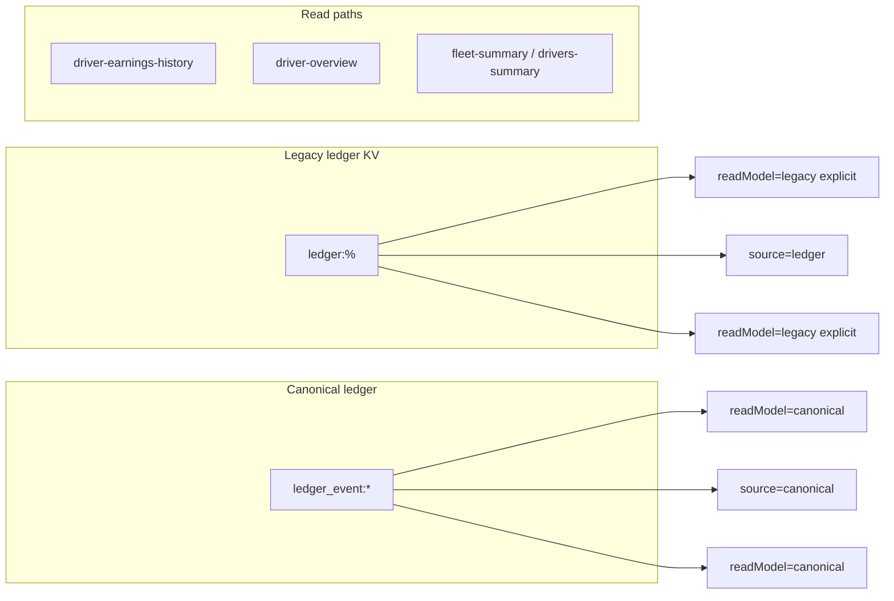

# Canonical takeover — phased implementation (safety-first)

**Scope:** Rollout from inventory → shadow diffs → fix gaps → switch reads → stop writes → backfill/archive → remove fallbacks.

**Source of truth:** This file plus [`docs/LEDGER_LEGACY_INVENTORY.md`](../docs/LEDGER_LEGACY_INVENTORY.md).

## Key code touchpoints

- Legacy reads/writes: [`supabase/functions/server/index.tsx`](./supabase/functions/server/index.tsx) (`generateTripLedgerEntries`, `GET /ledger/*`, repair/backfill routes) and [`services/api.ts`](./services/api.ts).
- Canonical aggregation: [`utils/ledgerMoneyAggregate.ts`](./utils/ledgerMoneyAggregate.ts), `aggregateCanonicalEventsToLedgerDriverOverview` (server: [`ledger_money_aggregate.ts`](./supabase/functions/server/ledger_money_aggregate.ts)). Fleet/drivers period aggregation uses shared **`aggregateFleetSummaryFromLedgerLikeEntries`** plus canonical paginated fetches on the server.
- Client flags: [`utils/featureFlags.ts`](./utils/featureFlags.ts) — **`isLedgerMoneyReadModelEnabled()`** (driver overview + **fleet-summary + drivers-summary** API `readModel`), **`isLedgerEarningsReadModelEnabled()`** (earnings history / payout rows).
- UI: [`DriverDetail.tsx`](./components/drivers/DriverDetail.tsx), [`DriverEarningsHistory.tsx`](./components/drivers/DriverEarningsHistory.tsx), [`Dashboard.tsx`](./components/dashboard/Dashboard.tsx) (fleet summary), [`DriversPage.tsx`](./components/drivers/DriversPage.tsx) (drivers summary).

---

## Phase 0 — Preflight, backups, and rules of engagement

**Goal:** Nothing moves until backups and ownership are clear.

**Steps:**

1. **Database backup:** Full Supabase (or host) backup of the project that holds KV / `kv_store_*`; store offline with date stamp.
2. **Logical exports:** Data Center / Trip Ledger / toll exports — CSVs for trips, tolls, transactions for a wide date range.
3. **Freeze window (optional):** Short window where bulk deletes / re-imports are avoided during shadow and cutover.
4. **Rollback principle:** Keep `localStorage` / `VITE_*` toggles documented as emergency switches until Phase 8.
5. **Exit criteria:** Backups verified restorable or exports verified complete; stakeholders acknowledge freeze rules.

---

## Phase 1 — Inventory: every reader and writer of `ledger:%`

**Goal:** Written register so nothing is starved when writes stop.

**Deliverable:** [`docs/LEDGER_LEGACY_INVENTORY.md`](../docs/LEDGER_LEGACY_INVENTORY.md).

---

## Phase 2 — Shadow comparison infrastructure

**Goal:** Server compares legacy vs canonical fare gross per bucket; logs when enabled.

**Implementation (in repo):**

- `GET /ledger/driver-earnings-history` supports **`shadowCompare=1`**. Server logs **`[LedgerEarningsShadow]`** (legacy vs canonical fare gross per period when both paths can be evaluated).

**Operational:** Sample in staging/production logs before relying solely on canonical numbers.

---

## Phase 3 — Fix canonical and data gaps

**Goal:** Reduce trip roll vs statement and missing events — **data/process**, not only code.

**Steps:** Re-run imports, use diagnostics (`GET /ledger/diagnostic-trip-ledger-gap`, in-app tools), re-sample shadow after fixes. If repair still needed and **`LEGACY_LEDGER_WRITES=true`**, repair endpoints can recreate legacy rows until cutover.

---

## Phase 4 — Switch reads: driver earnings history (canonical)

**Goal:** Earnings / payout views can use **`ledger_event:*`**.

**Implementation (in repo):**

- **`GET /ledger/driver-earnings-history?readModel=canonical`** — buckets from **`ledger_event:*`** (multi-driver ID resolution), same period math as legacy.
- **API default when param omitted:** **`readModel=legacy`** (explicit opt-in for direct callers).
- **Client:** [`isLedgerEarningsReadModelEnabled()`](./utils/featureFlags.ts) — when true, API gets **`readModel=canonical`**. **Production default is canonical** unless `VITE_LEDGER_EARNINGS_READ_MODEL=false` or `localStorage` **`roam_ledger_earnings_read_model`** = **`0`**. Development defaults to canonical unless that key is **`0`**.
- [`DriverEarningsHistory`](./components/drivers/DriverEarningsHistory.tsx), [`useDriverPayoutPeriodRows`](./hooks/useDriverPayoutPeriodRows.ts), [`SettlementSummaryView`](./components/drivers/SettlementSummaryView.tsx) use this flag.

---

## Phase 5 — Switch reads: fleet summary, drivers summary

**Goal:** Dashboard and drivers list financial aggregates can use canonical events.

**Implementation (in repo):**

- **`GET /ledger/fleet-summary?readModel=canonical`** — loads **`ledger_event:*`** in the date window, then **`aggregateFleetSummaryFromLedgerLikeEntries`** (same shape as legacy aggregation).
- **`GET /ledger/drivers-summary?readModel=canonical`** — all **`fare_earning`** rows from **`ledger_event:*`**, same per-driver lifetime / month / today buckets as legacy.
- **API default when param omitted:** **`readModel=legacy`**.
- **Client:** [`Dashboard.tsx`](./components/dashboard/Dashboard.tsx) and [`DriversPage.tsx`](./components/drivers/DriversPage.tsx) pass **`readModel`** from **`isLedgerMoneyReadModelEnabled()`** (aligned with canonical **driver-overview** money). React Query keys include the read model.
- **`driver-overview`:** still supports **`source=canonical`** vs legacy via existing flag on [`DriverDetail`](./components/drivers/DriverDetail.tsx) / API.

**Not done (full “legacy extinction”):** [`GET /ledger`](./supabase/functions/server/index.tsx), **`/ledger/count`**, **`/ledger/summary`**, and some diagnostics still read **`ledger:%`** only — see **Remaining work** below.

---

## Phase 6 — Stop new writes to `ledger:%`

**Goal:** No new rows in **`ledger:%`** once env is flipped; money events use **`ledger_event:*`** (append API, imports, etc.).

**Server env:** **`LEGACY_LEDGER_WRITES`** — unset or anything other than **`false`** = legacy writes allowed. **`false`** = legacy writes blocked.

**Implementation (in repo):** Helper **`legacyLedgerWritesDisabled()`** when **`LEGACY_LEDGER_WRITES=false`**:

- **`generateTripLedgerEntries`** — returns `[]` (no trip-sourced fare rows).
- **`buildUberFareEarningFallbackEntriesIfEligible`** — returns `[]` (no Uber fallback rows).
- **`generateTransactionLedgerEntry`** — returns **`null`** (no transaction → legacy fuel/expense rows).
- **`POST /ledger`**, **`POST /ledger/batch`**, **`PATCH /ledger/:id`** — **403** with message.
- **`POST /ledger/backfill`** — **403** when **not** dry-run (dry-run still allowed for preview).
- **`POST /ledger/repair-driver-ids`** — **403** when **not** dry-run.
- **`POST /ledger/repair-driver`**, **`POST /ledger/ensure-from-trip-ids`** — **403**.

Trip and fleet sync still **persist trips**; they simply stop writing **`ledger:%`** when the flag is off. **`DELETE /ledger/:id`** remains for admin cleanup of old rows.

**Stop point:** Set **`LEGACY_LEDGER_WRITES=false`** in Edge secrets only after operational sign-off.

---

## Phase 7 — Optional backfill or read-only archive

**Goal:** Historical periods fully represented in canonical **or** a documented cutoff / archive.

**Steps:** Decide backfill vs cutoff; idempotent keys; legal/ops approval before any purge of **`ledger:%`** keys.

---

## Phase 8 — Remove dual-path UI and flags

**Goal:** Drop **`localStorage` / `VITE_*`** toggles and legacy branches once rollback is no longer required.

**Status:** **Deferred** until canonical coverage is proven and Phase 7 decisions are made.

---

## Phase 9 — Verification, monitoring, and handoff

**Steps:**

1. Regression: driver overview, earnings, fleet/drivers summaries, Trip Ledger, Data Center, tolls.
2. Optional ongoing **`shadowCompare=1`** sampling while validating.

### Runbook

| Switch | Effect |
|--------|--------|
| **`roam_ledger_money_read_model`** = **`0`** | Force **legacy** driver overview + fleet/drivers summary reads (`isLedgerMoneyReadModelEnabled`). |
| **`VITE_LEDGER_MONEY_READ_MODEL=false`** | Production can force legacy money path (build-time). |
| **`roam_ledger_earnings_read_model`** = **`0`** | Force **legacy** earnings history / payout API reads. |
| **`VITE_LEDGER_EARNINGS_READ_MODEL=false`** | Production can force legacy earnings (build-time). |
| **`shadowCompare=1`** on earnings history | Logs **`[LedgerEarningsShadow]`** in Edge (use with **`readModel`** as needed). |
| **`LEGACY_LEDGER_WRITES=false`** | Blocks **all** listed legacy **write** paths (not only trip generator). |

---

## Remaining work for full legacy extinction

Track in [`docs/LEDGER_LEGACY_INVENTORY.md`](../docs/LEDGER_LEGACY_INVENTORY.md):

1. **Done (this repo):** **`GET /ledger`**, **`/ledger/count`**, **`/ledger/summary`** — default **`source=canonical`** (`ledger_event:*`); **`/ledger/diagnostic-trip-ledger-gap`** and **`/ledger/driver-indrive-wallet`** — **`source=canonical`** / **`both`** / **`legacy`**; count returns **`legacyLedgerEntries`** for diagnostics.
2. **API defaults:** **`readModel`** on fleet/drivers/earnings history and **`source`** on driver-overview default to **canonical** when the param is omitted; pass **`readModel=legacy`** or **`source=ledger`** for rollback.
3. **Trip delete / batch delete:** **`deleteLedgerEntriesForTripSource`** and related cleanup still target **`ledger:%`** until legacy data is gone or policy changes.
4. **Data:** Backfill historical **`ledger:%`** into **`ledger_event:*`**, or formal **cutoff date** + exports.
5. **Phase 8:** Remove dual UI, flags, and dead code paths after sign-off.

---

## Execution protocol

Large or irreversible changes (bulk purge, default API flips, production **`LEGACY_LEDGER_WRITES=false`**) should stay behind explicit approval and monitoring.
